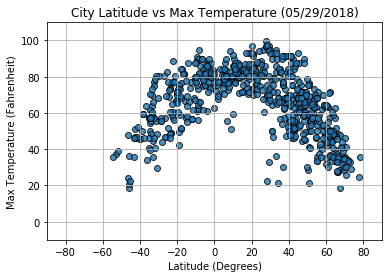
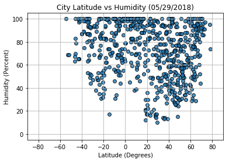
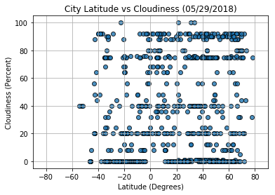
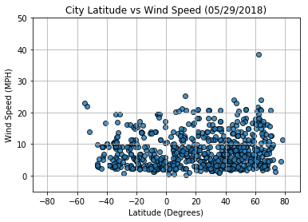

```python
# Dependencies
import csv
import matplotlib.pyplot as plt
import requests
import random
import datetime
import pandas as pd
from citipy import citipy

#import api_key
from config import api_key
```


```python
# Save config information.
url = "http://api.openweathermap.org/data/2.5/weather?"
units = "imperial"
```


```python
# Build partial query URL
query_url = f"{url}appid={api_key}&units={units}&q="
```


```python
#list to store cities
cities = []

#loop to build cities list
for i in range(0,2000):
    
    latitude = random.uniform(-90,90)
    longitude = random.uniform(-180,180)
    city = citipy.nearest_city(latitude, longitude)
    city_name = city.city_name
    cities.append(city_name)

#remove duplicates from cities list    
dup_items = set()
uniq_items = []
for x in cities:
    if x not in dup_items:
        uniq_items.append(x)
        dup_items.add(x)

#number of cities to be analyzed        
new_cities = list(dup_items)
len(new_cities)
```


    735


```python
#lists to be filled
name = []
lat = []
lon = []
temp = []
wind_speed = []
cloudiness = []
humidity = []
country = []
date = []
count = 1

#gettings todays date
now = datetime.datetime.now()
today = now.strftime("%m/%d/%Y")
```


```python
#header for api printout
print("Beginning Data Retrieval")
print("------------------------")

# loop through cities, make API request, and append desired results
for city in new_cities:
    response = requests.get(query_url + city).json()
    try:
        name.append(response['name'])
        lat.append(response['coord']['lat'])
        lon.append(response['coord']['lon'])
        temp.append(response['main']['temp_max'])
        humidity.append(response['main']['humidity'])
        wind_speed.append(response['wind']['speed'])
        cloudiness.append(response['clouds']['all'])
        country.append(response['sys']['country'])
        date.append(response['dt'])
    except:
        continue
    print(f"Processing Record {count} | {response['name']}")
    print(f"{requests.get(query_url + city).url}")
    count += 1

#footer for api printout
print("------------------------")
print("Data Retrieval Complete")
```

    Beginning Data Retrieval
    ------------------------
    Processing Record 1 | Laguna
    http://api.openweathermap.org/data/2.5/weather?appid=12f67a0810aab7ad7d238f94f4ccd1d3&units=imperial&q=laguna
    Processing Record 2 | Ryotsu
    http://api.openweathermap.org/data/2.5/weather?appid=12f67a0810aab7ad7d238f94f4ccd1d3&units=imperial&q=ryotsu
    Processing Record 3 | Mount Isa
    http://api.openweathermap.org/data/2.5/weather?appid=12f67a0810aab7ad7d238f94f4ccd1d3&units=imperial&q=mount%20isa
    Processing Record 4 | Elizabeth City
    http://api.openweathermap.org/data/2.5/weather?appid=12f67a0810aab7ad7d238f94f4ccd1d3&units=imperial&q=elizabeth%20city
    Processing Record 5 | Bredasdorp
    http://api.openweathermap.org/data/2.5/weather?appid=12f67a0810aab7ad7d238f94f4ccd1d3&units=imperial&q=bredasdorp
    Processing Record 6 | Takapau
    http://api.openweathermap.org/data/2.5/weather?appid=12f67a0810aab7ad7d238f94f4ccd1d3&units=imperial&q=takapau
    Processing Record 7 | Ulladulla
    http://api.openweathermap.org/data/2.5/weather?appid=12f67a0810aab7ad7d238f94f4ccd1d3&units=imperial&q=ulladulla
    Processing Record 8 | Tefe
    http://api.openweathermap.org/data/2.5/weather?appid=12f67a0810aab7ad7d238f94f4ccd1d3&units=imperial&q=tefe
    Processing Record 9 | Port Lincoln
    http://api.openweathermap.org/data/2.5/weather?appid=12f67a0810aab7ad7d238f94f4ccd1d3&units=imperial&q=port%20lincoln
    Processing Record 10 | New Norfolk
    http://api.openweathermap.org/data/2.5/weather?appid=12f67a0810aab7ad7d238f94f4ccd1d3&units=imperial&q=new%20norfolk
    Processing Record 11 | Kisiwani
    http://api.openweathermap.org/data/2.5/weather?appid=12f67a0810aab7ad7d238f94f4ccd1d3&units=imperial&q=kisiwani
    Processing Record 12 | Hilo
    http://api.openweathermap.org/data/2.5/weather?appid=12f67a0810aab7ad7d238f94f4ccd1d3&units=imperial&q=hilo
    Processing Record 13 | Dzaoudzi
    http://api.openweathermap.org/data/2.5/weather?appid=12f67a0810aab7ad7d238f94f4ccd1d3&units=imperial&q=dzaoudzi
    Processing Record 14 | Storforshei
    http://api.openweathermap.org/data/2.5/weather?appid=12f67a0810aab7ad7d238f94f4ccd1d3&units=imperial&q=storforshei
    Processing Record 15 | Luderitz
    http://api.openweathermap.org/data/2.5/weather?appid=12f67a0810aab7ad7d238f94f4ccd1d3&units=imperial&q=luderitz
    Processing Record 16 | Kamenka
    http://api.openweathermap.org/data/2.5/weather?appid=12f67a0810aab7ad7d238f94f4ccd1d3&units=imperial&q=kamenka
    Processing Record 17 | Homer
    http://api.openweathermap.org/data/2.5/weather?appid=12f67a0810aab7ad7d238f94f4ccd1d3&units=imperial&q=homer
    Processing Record 18 | Matay
    http://api.openweathermap.org/data/2.5/weather?appid=12f67a0810aab7ad7d238f94f4ccd1d3&units=imperial&q=matay
    Processing Record 19 | Axim
    http://api.openweathermap.org/data/2.5/weather?appid=12f67a0810aab7ad7d238f94f4ccd1d3&units=imperial&q=axim
    Processing Record 20 | Gwadar
    http://api.openweathermap.org/data/2.5/weather?appid=12f67a0810aab7ad7d238f94f4ccd1d3&units=imperial&q=gwadar
    Processing Record 21 | Norman Wells
    http://api.openweathermap.org/data/2.5/weather?appid=12f67a0810aab7ad7d238f94f4ccd1d3&units=imperial&q=norman%20wells
    Processing Record 22 | Palmer
    http://api.openweathermap.org/data/2.5/weather?appid=12f67a0810aab7ad7d238f94f4ccd1d3&units=imperial&q=palmer
    Processing Record 23 | Cedar City
    http://api.openweathermap.org/data/2.5/weather?appid=12f67a0810aab7ad7d238f94f4ccd1d3&units=imperial&q=cedar%20city
    Processing Record 24 | Nara
    http://api.openweathermap.org/data/2.5/weather?appid=12f67a0810aab7ad7d238f94f4ccd1d3&units=imperial&q=nara
    Processing Record 25 | Aberdeen
    http://api.openweathermap.org/data/2.5/weather?appid=12f67a0810aab7ad7d238f94f4ccd1d3&units=imperial&q=aberdeen
    Processing Record 26 | Punta Arenas
    http://api.openweathermap.org/data/2.5/weather?appid=12f67a0810aab7ad7d238f94f4ccd1d3&units=imperial&q=punta%20arenas
    Processing Record 27 | Saint Anthony
    http://api.openweathermap.org/data/2.5/weather?appid=12f67a0810aab7ad7d238f94f4ccd1d3&units=imperial&q=saint%20anthony
    Processing Record 28 | Vanavara
    http://api.openweathermap.org/data/2.5/weather?appid=12f67a0810aab7ad7d238f94f4ccd1d3&units=imperial&q=vanavara
    Processing Record 29 | Mandera
    http://api.openweathermap.org/data/2.5/weather?appid=12f67a0810aab7ad7d238f94f4ccd1d3&units=imperial&q=mandera
    Processing Record 30 | Hambantota
    http://api.openweathermap.org/data/2.5/weather?appid=12f67a0810aab7ad7d238f94f4ccd1d3&units=imperial&q=hambantota
    Processing Record 31 | Sao Francisco
    http://api.openweathermap.org/data/2.5/weather?appid=12f67a0810aab7ad7d238f94f4ccd1d3&units=imperial&q=sao%20francisco
    Processing Record 32 | Ankazobe
    http://api.openweathermap.org/data/2.5/weather?appid=12f67a0810aab7ad7d238f94f4ccd1d3&units=imperial&q=ankazobe
    Processing Record 33 | Raudeberg
    http://api.openweathermap.org/data/2.5/weather?appid=12f67a0810aab7ad7d238f94f4ccd1d3&units=imperial&q=raudeberg
    Processing Record 34 | Malanje
    http://api.openweathermap.org/data/2.5/weather?appid=12f67a0810aab7ad7d238f94f4ccd1d3&units=imperial&q=malanje
    Processing Record 35 | Baker City
    http://api.openweathermap.org/data/2.5/weather?appid=12f67a0810aab7ad7d238f94f4ccd1d3&units=imperial&q=baker%20city
    Processing Record 36 | Nyurba
    http://api.openweathermap.org/data/2.5/weather?appid=12f67a0810aab7ad7d238f94f4ccd1d3&units=imperial&q=nyurba
    Processing Record 37 | La Palma
    http://api.openweathermap.org/data/2.5/weather?appid=12f67a0810aab7ad7d238f94f4ccd1d3&units=imperial&q=la%20palma
    Processing Record 38 | Miracema do Tocantins
    http://api.openweathermap.org/data/2.5/weather?appid=12f67a0810aab7ad7d238f94f4ccd1d3&units=imperial&q=miracema%20do%20tocantins
    Processing Record 39 | Basay
    http://api.openweathermap.org/data/2.5/weather?appid=12f67a0810aab7ad7d238f94f4ccd1d3&units=imperial&q=basay
    Processing Record 40 | Temiscaming
    http://api.openweathermap.org/data/2.5/weather?appid=12f67a0810aab7ad7d238f94f4ccd1d3&units=imperial&q=temiscaming
    Processing Record 41 | Lucapa
    http://api.openweathermap.org/data/2.5/weather?appid=12f67a0810aab7ad7d238f94f4ccd1d3&units=imperial&q=lucapa
    Processing Record 42 | Liverpool
    http://api.openweathermap.org/data/2.5/weather?appid=12f67a0810aab7ad7d238f94f4ccd1d3&units=imperial&q=liverpool
    Processing Record 43 | Raahe
    http://api.openweathermap.org/data/2.5/weather?appid=12f67a0810aab7ad7d238f94f4ccd1d3&units=imperial&q=raahe
    Processing Record 44 | Marsabit
    http://api.openweathermap.org/data/2.5/weather?appid=12f67a0810aab7ad7d238f94f4ccd1d3&units=imperial&q=marsabit
    Processing Record 45 | Hondo
    http://api.openweathermap.org/data/2.5/weather?appid=12f67a0810aab7ad7d238f94f4ccd1d3&units=imperial&q=hondo
    Processing Record 46 | Inuvik
    http://api.openweathermap.org/data/2.5/weather?appid=12f67a0810aab7ad7d238f94f4ccd1d3&units=imperial&q=inuvik
    Processing Record 47 | Baghdad
    http://api.openweathermap.org/data/2.5/weather?appid=12f67a0810aab7ad7d238f94f4ccd1d3&units=imperial&q=baghdad
    Processing Record 48 | Sarana
    http://api.openweathermap.org/data/2.5/weather?appid=12f67a0810aab7ad7d238f94f4ccd1d3&units=imperial&q=sarana
    Processing Record 49 | Ginda
    http://api.openweathermap.org/data/2.5/weather?appid=12f67a0810aab7ad7d238f94f4ccd1d3&units=imperial&q=ginda
    Processing Record 50 | Severo-Yeniseyskiy
    http://api.openweathermap.org/data/2.5/weather?appid=12f67a0810aab7ad7d238f94f4ccd1d3&units=imperial&q=severo-yeniseyskiy
    Processing Record 51 | Tiksi
    http://api.openweathermap.org/data/2.5/weather?appid=12f67a0810aab7ad7d238f94f4ccd1d3&units=imperial&q=tiksi
    Processing Record 52 | Carnarvon
    http://api.openweathermap.org/data/2.5/weather?appid=12f67a0810aab7ad7d238f94f4ccd1d3&units=imperial&q=carnarvon
    Processing Record 53 | Ciudad Bolivar
    http://api.openweathermap.org/data/2.5/weather?appid=12f67a0810aab7ad7d238f94f4ccd1d3&units=imperial&q=ciudad%20bolivar
    Processing Record 54 | Saint George
    http://api.openweathermap.org/data/2.5/weather?appid=12f67a0810aab7ad7d238f94f4ccd1d3&units=imperial&q=saint%20george
    Processing Record 55 | Busselton
    http://api.openweathermap.org/data/2.5/weather?appid=12f67a0810aab7ad7d238f94f4ccd1d3&units=imperial&q=busselton
    Processing Record 56 | Ulagan
    http://api.openweathermap.org/data/2.5/weather?appid=12f67a0810aab7ad7d238f94f4ccd1d3&units=imperial&q=ulagan
    Processing Record 57 | Rikitea
    http://api.openweathermap.org/data/2.5/weather?appid=12f67a0810aab7ad7d238f94f4ccd1d3&units=imperial&q=rikitea
    Processing Record 58 | Huilong
    http://api.openweathermap.org/data/2.5/weather?appid=12f67a0810aab7ad7d238f94f4ccd1d3&units=imperial&q=huilong
    Processing Record 59 | Paamiut
    http://api.openweathermap.org/data/2.5/weather?appid=12f67a0810aab7ad7d238f94f4ccd1d3&units=imperial&q=paamiut
    Processing Record 60 | Puerto Ayora
    http://api.openweathermap.org/data/2.5/weather?appid=12f67a0810aab7ad7d238f94f4ccd1d3&units=imperial&q=puerto%20ayora
    Processing Record 61 | Erzin
    http://api.openweathermap.org/data/2.5/weather?appid=12f67a0810aab7ad7d238f94f4ccd1d3&units=imperial&q=erzin
    Processing Record 62 | Ekhabi
    http://api.openweathermap.org/data/2.5/weather?appid=12f67a0810aab7ad7d238f94f4ccd1d3&units=imperial&q=ekhabi
    Processing Record 63 | Vanimo
    http://api.openweathermap.org/data/2.5/weather?appid=12f67a0810aab7ad7d238f94f4ccd1d3&units=imperial&q=vanimo
    Processing Record 64 | Khani
    http://api.openweathermap.org/data/2.5/weather?appid=12f67a0810aab7ad7d238f94f4ccd1d3&units=imperial&q=khani
    Processing Record 65 | Seredka
    http://api.openweathermap.org/data/2.5/weather?appid=12f67a0810aab7ad7d238f94f4ccd1d3&units=imperial&q=seredka
    Processing Record 66 | Bell Ville
    http://api.openweathermap.org/data/2.5/weather?appid=12f67a0810aab7ad7d238f94f4ccd1d3&units=imperial&q=bell%20ville
    Processing Record 67 | Japura
    http://api.openweathermap.org/data/2.5/weather?appid=12f67a0810aab7ad7d238f94f4ccd1d3&units=imperial&q=japura
    Processing Record 68 | Tigil
    http://api.openweathermap.org/data/2.5/weather?appid=12f67a0810aab7ad7d238f94f4ccd1d3&units=imperial&q=tigil
    Processing Record 69 | Sola
    http://api.openweathermap.org/data/2.5/weather?appid=12f67a0810aab7ad7d238f94f4ccd1d3&units=imperial&q=sola
    Processing Record 70 | Qaanaaq
    http://api.openweathermap.org/data/2.5/weather?appid=12f67a0810aab7ad7d238f94f4ccd1d3&units=imperial&q=qaanaaq
    Processing Record 71 | Filadelfia
    http://api.openweathermap.org/data/2.5/weather?appid=12f67a0810aab7ad7d238f94f4ccd1d3&units=imperial&q=filadelfia
    Processing Record 72 | Srednekolymsk
    http://api.openweathermap.org/data/2.5/weather?appid=12f67a0810aab7ad7d238f94f4ccd1d3&units=imperial&q=srednekolymsk
    Processing Record 73 | Kavaratti
    http://api.openweathermap.org/data/2.5/weather?appid=12f67a0810aab7ad7d238f94f4ccd1d3&units=imperial&q=kavaratti
    Processing Record 74 | Benicarlo
    http://api.openweathermap.org/data/2.5/weather?appid=12f67a0810aab7ad7d238f94f4ccd1d3&units=imperial&q=benicarlo
    Processing Record 75 | Panzhihua
    http://api.openweathermap.org/data/2.5/weather?appid=12f67a0810aab7ad7d238f94f4ccd1d3&units=imperial&q=panzhihua
    Processing Record 76 | Bull Savanna
    http://api.openweathermap.org/data/2.5/weather?appid=12f67a0810aab7ad7d238f94f4ccd1d3&units=imperial&q=bull%20savanna
    Processing Record 77 | Chongwe
    http://api.openweathermap.org/data/2.5/weather?appid=12f67a0810aab7ad7d238f94f4ccd1d3&units=imperial&q=chongwe
    Processing Record 78 | Pierre
    http://api.openweathermap.org/data/2.5/weather?appid=12f67a0810aab7ad7d238f94f4ccd1d3&units=imperial&q=pierre
    Processing Record 79 | Saskylakh
    http://api.openweathermap.org/data/2.5/weather?appid=12f67a0810aab7ad7d238f94f4ccd1d3&units=imperial&q=saskylakh
    Processing Record 80 | Chikwawa
    http://api.openweathermap.org/data/2.5/weather?appid=12f67a0810aab7ad7d238f94f4ccd1d3&units=imperial&q=chikwawa
    Processing Record 81 | San Quintin
    http://api.openweathermap.org/data/2.5/weather?appid=12f67a0810aab7ad7d238f94f4ccd1d3&units=imperial&q=san%20quintin
    Processing Record 82 | Mataura
    http://api.openweathermap.org/data/2.5/weather?appid=12f67a0810aab7ad7d238f94f4ccd1d3&units=imperial&q=mataura
    Processing Record 83 | Mahebourg
    http://api.openweathermap.org/data/2.5/weather?appid=12f67a0810aab7ad7d238f94f4ccd1d3&units=imperial&q=mahebourg
    Processing Record 84 | Tiarei
    http://api.openweathermap.org/data/2.5/weather?appid=12f67a0810aab7ad7d238f94f4ccd1d3&units=imperial&q=tiarei
    Processing Record 85 | Porto Velho
    http://api.openweathermap.org/data/2.5/weather?appid=12f67a0810aab7ad7d238f94f4ccd1d3&units=imperial&q=porto%20velho
    Processing Record 86 | Pakokku
    http://api.openweathermap.org/data/2.5/weather?appid=12f67a0810aab7ad7d238f94f4ccd1d3&units=imperial&q=pakokku
    Processing Record 87 | Bethel
    http://api.openweathermap.org/data/2.5/weather?appid=12f67a0810aab7ad7d238f94f4ccd1d3&units=imperial&q=bethel
    Processing Record 88 | Bitung
    http://api.openweathermap.org/data/2.5/weather?appid=12f67a0810aab7ad7d238f94f4ccd1d3&units=imperial&q=bitung
    Processing Record 89 | Vanersborg
    http://api.openweathermap.org/data/2.5/weather?appid=12f67a0810aab7ad7d238f94f4ccd1d3&units=imperial&q=vanersborg
    Processing Record 90 | Lamu
    http://api.openweathermap.org/data/2.5/weather?appid=12f67a0810aab7ad7d238f94f4ccd1d3&units=imperial&q=lamu
    Processing Record 91 | El Mante
    http://api.openweathermap.org/data/2.5/weather?appid=12f67a0810aab7ad7d238f94f4ccd1d3&units=imperial&q=el%20mante
    Processing Record 92 | Kaitangata
    http://api.openweathermap.org/data/2.5/weather?appid=12f67a0810aab7ad7d238f94f4ccd1d3&units=imperial&q=kaitangata
    Processing Record 93 | Yinchuan
    http://api.openweathermap.org/data/2.5/weather?appid=12f67a0810aab7ad7d238f94f4ccd1d3&units=imperial&q=yinchuan
    Processing Record 94 | Vaitape
    http://api.openweathermap.org/data/2.5/weather?appid=12f67a0810aab7ad7d238f94f4ccd1d3&units=imperial&q=vaitape
    Processing Record 95 | Nouakchott
    http://api.openweathermap.org/data/2.5/weather?appid=12f67a0810aab7ad7d238f94f4ccd1d3&units=imperial&q=nouakchott
    Processing Record 96 | Teguldet
    http://api.openweathermap.org/data/2.5/weather?appid=12f67a0810aab7ad7d238f94f4ccd1d3&units=imperial&q=teguldet
    Processing Record 97 | Mundo Nuevo
    http://api.openweathermap.org/data/2.5/weather?appid=12f67a0810aab7ad7d238f94f4ccd1d3&units=imperial&q=mundo%20nuevo
    Processing Record 98 | Albany
    http://api.openweathermap.org/data/2.5/weather?appid=12f67a0810aab7ad7d238f94f4ccd1d3&units=imperial&q=albany
    Processing Record 99 | Katobu
    http://api.openweathermap.org/data/2.5/weather?appid=12f67a0810aab7ad7d238f94f4ccd1d3&units=imperial&q=katobu
    Processing Record 100 | Bambous Virieux
    http://api.openweathermap.org/data/2.5/weather?appid=12f67a0810aab7ad7d238f94f4ccd1d3&units=imperial&q=bambous%20virieux
    Processing Record 101 | Wamba
    http://api.openweathermap.org/data/2.5/weather?appid=12f67a0810aab7ad7d238f94f4ccd1d3&units=imperial&q=wamba
    Processing Record 102 | Port Pirie
    http://api.openweathermap.org/data/2.5/weather?appid=12f67a0810aab7ad7d238f94f4ccd1d3&units=imperial&q=port%20pirie
    Processing Record 103 | Pachino
    http://api.openweathermap.org/data/2.5/weather?appid=12f67a0810aab7ad7d238f94f4ccd1d3&units=imperial&q=pachino
    Processing Record 104 | Pedra Branca
    http://api.openweathermap.org/data/2.5/weather?appid=12f67a0810aab7ad7d238f94f4ccd1d3&units=imperial&q=pedra%20branca
    Processing Record 105 | Denpasar
    http://api.openweathermap.org/data/2.5/weather?appid=12f67a0810aab7ad7d238f94f4ccd1d3&units=imperial&q=denpasar
    Processing Record 106 | Sao Filipe
    http://api.openweathermap.org/data/2.5/weather?appid=12f67a0810aab7ad7d238f94f4ccd1d3&units=imperial&q=sao%20filipe
    Processing Record 107 | Nantucket
    http://api.openweathermap.org/data/2.5/weather?appid=12f67a0810aab7ad7d238f94f4ccd1d3&units=imperial&q=nantucket
    Processing Record 108 | Husavik
    http://api.openweathermap.org/data/2.5/weather?appid=12f67a0810aab7ad7d238f94f4ccd1d3&units=imperial&q=husavik
    Processing Record 109 | Luanda
    http://api.openweathermap.org/data/2.5/weather?appid=12f67a0810aab7ad7d238f94f4ccd1d3&units=imperial&q=luanda
    Processing Record 110 | Oksfjord
    http://api.openweathermap.org/data/2.5/weather?appid=12f67a0810aab7ad7d238f94f4ccd1d3&units=imperial&q=oksfjord
    Processing Record 111 | Luganville
    http://api.openweathermap.org/data/2.5/weather?appid=12f67a0810aab7ad7d238f94f4ccd1d3&units=imperial&q=luganville
    Processing Record 112 | Taremskoye
    http://api.openweathermap.org/data/2.5/weather?appid=12f67a0810aab7ad7d238f94f4ccd1d3&units=imperial&q=taremskoye
    Processing Record 113 | Lavrentiya
    http://api.openweathermap.org/data/2.5/weather?appid=12f67a0810aab7ad7d238f94f4ccd1d3&units=imperial&q=lavrentiya
    Processing Record 114 | Quibdo
    http://api.openweathermap.org/data/2.5/weather?appid=12f67a0810aab7ad7d238f94f4ccd1d3&units=imperial&q=quibdo
    Processing Record 115 | Butaritari
    http://api.openweathermap.org/data/2.5/weather?appid=12f67a0810aab7ad7d238f94f4ccd1d3&units=imperial&q=butaritari
    Processing Record 116 | Manyana
    http://api.openweathermap.org/data/2.5/weather?appid=12f67a0810aab7ad7d238f94f4ccd1d3&units=imperial&q=manyana
    Processing Record 117 | Yar-Sale
    http://api.openweathermap.org/data/2.5/weather?appid=12f67a0810aab7ad7d238f94f4ccd1d3&units=imperial&q=yar-sale
    Processing Record 118 | Belaya Gora
    http://api.openweathermap.org/data/2.5/weather?appid=12f67a0810aab7ad7d238f94f4ccd1d3&units=imperial&q=belaya%20gora
    Processing Record 119 | Durban
    http://api.openweathermap.org/data/2.5/weather?appid=12f67a0810aab7ad7d238f94f4ccd1d3&units=imperial&q=durban
    Processing Record 120 | Ribeira Brava
    http://api.openweathermap.org/data/2.5/weather?appid=12f67a0810aab7ad7d238f94f4ccd1d3&units=imperial&q=ribeira%20brava
    Processing Record 121 | Coracora
    http://api.openweathermap.org/data/2.5/weather?appid=12f67a0810aab7ad7d238f94f4ccd1d3&units=imperial&q=coracora
    Processing Record 122 | Guerrero Negro
    http://api.openweathermap.org/data/2.5/weather?appid=12f67a0810aab7ad7d238f94f4ccd1d3&units=imperial&q=guerrero%20negro
    Processing Record 123 | Kabanga
    http://api.openweathermap.org/data/2.5/weather?appid=12f67a0810aab7ad7d238f94f4ccd1d3&units=imperial&q=kabanga
    Processing Record 124 | College
    http://api.openweathermap.org/data/2.5/weather?appid=12f67a0810aab7ad7d238f94f4ccd1d3&units=imperial&q=college
    Processing Record 125 | Kirakira
    http://api.openweathermap.org/data/2.5/weather?appid=12f67a0810aab7ad7d238f94f4ccd1d3&units=imperial&q=kirakira
    Processing Record 126 | Berdigestyakh
    http://api.openweathermap.org/data/2.5/weather?appid=12f67a0810aab7ad7d238f94f4ccd1d3&units=imperial&q=berdigestyakh
    Processing Record 127 | Devgarh
    http://api.openweathermap.org/data/2.5/weather?appid=12f67a0810aab7ad7d238f94f4ccd1d3&units=imperial&q=devgarh
    Processing Record 128 | Chegutu
    http://api.openweathermap.org/data/2.5/weather?appid=12f67a0810aab7ad7d238f94f4ccd1d3&units=imperial&q=chegutu
    Processing Record 129 | Rosarito
    http://api.openweathermap.org/data/2.5/weather?appid=12f67a0810aab7ad7d238f94f4ccd1d3&units=imperial&q=rosarito
    Processing Record 130 | Olavarria
    http://api.openweathermap.org/data/2.5/weather?appid=12f67a0810aab7ad7d238f94f4ccd1d3&units=imperial&q=olavarria
    Processing Record 131 | Caravelas
    http://api.openweathermap.org/data/2.5/weather?appid=12f67a0810aab7ad7d238f94f4ccd1d3&units=imperial&q=caravelas
    Processing Record 132 | Ocampo
    http://api.openweathermap.org/data/2.5/weather?appid=12f67a0810aab7ad7d238f94f4ccd1d3&units=imperial&q=ocampo
    Processing Record 133 | Dandong
    http://api.openweathermap.org/data/2.5/weather?appid=12f67a0810aab7ad7d238f94f4ccd1d3&units=imperial&q=dandong
    Processing Record 134 | Bom Jesus
    http://api.openweathermap.org/data/2.5/weather?appid=12f67a0810aab7ad7d238f94f4ccd1d3&units=imperial&q=bom%20jesus
    Processing Record 135 | Noumea
    http://api.openweathermap.org/data/2.5/weather?appid=12f67a0810aab7ad7d238f94f4ccd1d3&units=imperial&q=noumea
    Processing Record 136 | Northam
    http://api.openweathermap.org/data/2.5/weather?appid=12f67a0810aab7ad7d238f94f4ccd1d3&units=imperial&q=northam
    Processing Record 137 | Saint-Augustin
    http://api.openweathermap.org/data/2.5/weather?appid=12f67a0810aab7ad7d238f94f4ccd1d3&units=imperial&q=saint-augustin
    Processing Record 138 | Avarua
    http://api.openweathermap.org/data/2.5/weather?appid=12f67a0810aab7ad7d238f94f4ccd1d3&units=imperial&q=avarua
    Processing Record 139 | Ratnagiri
    http://api.openweathermap.org/data/2.5/weather?appid=12f67a0810aab7ad7d238f94f4ccd1d3&units=imperial&q=ratnagiri
    Processing Record 140 | Poum
    http://api.openweathermap.org/data/2.5/weather?appid=12f67a0810aab7ad7d238f94f4ccd1d3&units=imperial&q=poum
    Processing Record 141 | Faanui
    http://api.openweathermap.org/data/2.5/weather?appid=12f67a0810aab7ad7d238f94f4ccd1d3&units=imperial&q=faanui
    Processing Record 142 | Naples
    http://api.openweathermap.org/data/2.5/weather?appid=12f67a0810aab7ad7d238f94f4ccd1d3&units=imperial&q=naples
    Processing Record 143 | Aksarka
    http://api.openweathermap.org/data/2.5/weather?appid=12f67a0810aab7ad7d238f94f4ccd1d3&units=imperial&q=aksarka
    Processing Record 144 | Moose Factory
    http://api.openweathermap.org/data/2.5/weather?appid=12f67a0810aab7ad7d238f94f4ccd1d3&units=imperial&q=moose%20factory
    Processing Record 145 | Coahuayana
    http://api.openweathermap.org/data/2.5/weather?appid=12f67a0810aab7ad7d238f94f4ccd1d3&units=imperial&q=coahuayana
    Processing Record 146 | Lyaskelya
    http://api.openweathermap.org/data/2.5/weather?appid=12f67a0810aab7ad7d238f94f4ccd1d3&units=imperial&q=lyaskelya
    Processing Record 147 | Bilma
    http://api.openweathermap.org/data/2.5/weather?appid=12f67a0810aab7ad7d238f94f4ccd1d3&units=imperial&q=bilma
    Processing Record 148 | Prince Rupert
    http://api.openweathermap.org/data/2.5/weather?appid=12f67a0810aab7ad7d238f94f4ccd1d3&units=imperial&q=prince%20rupert
    Processing Record 149 | Surt
    http://api.openweathermap.org/data/2.5/weather?appid=12f67a0810aab7ad7d238f94f4ccd1d3&units=imperial&q=surt
    Processing Record 150 | Castro
    http://api.openweathermap.org/data/2.5/weather?appid=12f67a0810aab7ad7d238f94f4ccd1d3&units=imperial&q=castro
    Processing Record 151 | Bathsheba
    http://api.openweathermap.org/data/2.5/weather?appid=12f67a0810aab7ad7d238f94f4ccd1d3&units=imperial&q=bathsheba
    Processing Record 152 | Nouadhibou
    http://api.openweathermap.org/data/2.5/weather?appid=12f67a0810aab7ad7d238f94f4ccd1d3&units=imperial&q=nouadhibou
    Processing Record 153 | Timmins
    http://api.openweathermap.org/data/2.5/weather?appid=12f67a0810aab7ad7d238f94f4ccd1d3&units=imperial&q=timmins
    Processing Record 154 | Athabasca
    http://api.openweathermap.org/data/2.5/weather?appid=12f67a0810aab7ad7d238f94f4ccd1d3&units=imperial&q=athabasca
    Processing Record 155 | San Cristobal
    http://api.openweathermap.org/data/2.5/weather?appid=12f67a0810aab7ad7d238f94f4ccd1d3&units=imperial&q=san%20cristobal
    Processing Record 156 | Soyo
    http://api.openweathermap.org/data/2.5/weather?appid=12f67a0810aab7ad7d238f94f4ccd1d3&units=imperial&q=soyo
    Processing Record 157 | Southbridge
    http://api.openweathermap.org/data/2.5/weather?appid=12f67a0810aab7ad7d238f94f4ccd1d3&units=imperial&q=southbridge
    Processing Record 158 | Alofi
    http://api.openweathermap.org/data/2.5/weather?appid=12f67a0810aab7ad7d238f94f4ccd1d3&units=imperial&q=alofi
    Processing Record 159 | Los Llanos de Aridane
    http://api.openweathermap.org/data/2.5/weather?appid=12f67a0810aab7ad7d238f94f4ccd1d3&units=imperial&q=los%20llanos%20de%20aridane
    Processing Record 160 | Beaumont
    http://api.openweathermap.org/data/2.5/weather?appid=12f67a0810aab7ad7d238f94f4ccd1d3&units=imperial&q=beaumont
    Processing Record 161 | Ust-Koksa
    http://api.openweathermap.org/data/2.5/weather?appid=12f67a0810aab7ad7d238f94f4ccd1d3&units=imperial&q=ust-koksa
    Processing Record 162 | Stykkisholmur
    http://api.openweathermap.org/data/2.5/weather?appid=12f67a0810aab7ad7d238f94f4ccd1d3&units=imperial&q=stykkisholmur
    Processing Record 163 | Pisco
    http://api.openweathermap.org/data/2.5/weather?appid=12f67a0810aab7ad7d238f94f4ccd1d3&units=imperial&q=pisco
    Processing Record 164 | Cabedelo
    http://api.openweathermap.org/data/2.5/weather?appid=12f67a0810aab7ad7d238f94f4ccd1d3&units=imperial&q=cabedelo
    Processing Record 165 | Pangkalanbuun
    http://api.openweathermap.org/data/2.5/weather?appid=12f67a0810aab7ad7d238f94f4ccd1d3&units=imperial&q=pangkalanbuun
    Processing Record 166 | Semirom
    http://api.openweathermap.org/data/2.5/weather?appid=12f67a0810aab7ad7d238f94f4ccd1d3&units=imperial&q=semirom
    Processing Record 167 | Lata
    http://api.openweathermap.org/data/2.5/weather?appid=12f67a0810aab7ad7d238f94f4ccd1d3&units=imperial&q=lata
    Processing Record 168 | Tuchola
    http://api.openweathermap.org/data/2.5/weather?appid=12f67a0810aab7ad7d238f94f4ccd1d3&units=imperial&q=tuchola
    Processing Record 169 | La Salle
    http://api.openweathermap.org/data/2.5/weather?appid=12f67a0810aab7ad7d238f94f4ccd1d3&units=imperial&q=la%20salle
    Processing Record 170 | Buala
    http://api.openweathermap.org/data/2.5/weather?appid=12f67a0810aab7ad7d238f94f4ccd1d3&units=imperial&q=buala
    Processing Record 171 | Havre-Saint-Pierre
    http://api.openweathermap.org/data/2.5/weather?appid=12f67a0810aab7ad7d238f94f4ccd1d3&units=imperial&q=havre-saint-pierre
    Processing Record 172 | Dongzhen
    http://api.openweathermap.org/data/2.5/weather?appid=12f67a0810aab7ad7d238f94f4ccd1d3&units=imperial&q=dongzhen
    Processing Record 173 | Arlit
    http://api.openweathermap.org/data/2.5/weather?appid=12f67a0810aab7ad7d238f94f4ccd1d3&units=imperial&q=arlit
    Processing Record 174 | Puerto Madryn
    http://api.openweathermap.org/data/2.5/weather?appid=12f67a0810aab7ad7d238f94f4ccd1d3&units=imperial&q=puerto%20madryn
    Processing Record 175 | Xiashi
    http://api.openweathermap.org/data/2.5/weather?appid=12f67a0810aab7ad7d238f94f4ccd1d3&units=imperial&q=xiashi
    Processing Record 176 | Tacoronte
    http://api.openweathermap.org/data/2.5/weather?appid=12f67a0810aab7ad7d238f94f4ccd1d3&units=imperial&q=tacoronte
    Processing Record 177 | Vilyuysk
    http://api.openweathermap.org/data/2.5/weather?appid=12f67a0810aab7ad7d238f94f4ccd1d3&units=imperial&q=vilyuysk
    Processing Record 178 | Jizan
    http://api.openweathermap.org/data/2.5/weather?appid=12f67a0810aab7ad7d238f94f4ccd1d3&units=imperial&q=jizan
    Processing Record 179 | Isla Mujeres
    http://api.openweathermap.org/data/2.5/weather?appid=12f67a0810aab7ad7d238f94f4ccd1d3&units=imperial&q=isla%20mujeres
    Processing Record 180 | Tongliao
    http://api.openweathermap.org/data/2.5/weather?appid=12f67a0810aab7ad7d238f94f4ccd1d3&units=imperial&q=tongliao
    Processing Record 181 | Bone
    http://api.openweathermap.org/data/2.5/weather?appid=12f67a0810aab7ad7d238f94f4ccd1d3&units=imperial&q=bone
    Processing Record 182 | Tautira
    http://api.openweathermap.org/data/2.5/weather?appid=12f67a0810aab7ad7d238f94f4ccd1d3&units=imperial&q=tautira
    Processing Record 183 | Yellowknife
    http://api.openweathermap.org/data/2.5/weather?appid=12f67a0810aab7ad7d238f94f4ccd1d3&units=imperial&q=yellowknife
    Processing Record 184 | Lyubashivka
    http://api.openweathermap.org/data/2.5/weather?appid=12f67a0810aab7ad7d238f94f4ccd1d3&units=imperial&q=lyubashivka
    Processing Record 185 | Anito
    http://api.openweathermap.org/data/2.5/weather?appid=12f67a0810aab7ad7d238f94f4ccd1d3&units=imperial&q=anito
    Processing Record 186 | Chuy
    http://api.openweathermap.org/data/2.5/weather?appid=12f67a0810aab7ad7d238f94f4ccd1d3&units=imperial&q=chuy
    Processing Record 187 | Ha Giang
    http://api.openweathermap.org/data/2.5/weather?appid=12f67a0810aab7ad7d238f94f4ccd1d3&units=imperial&q=ha%20giang
    Processing Record 188 | Kodinar
    http://api.openweathermap.org/data/2.5/weather?appid=12f67a0810aab7ad7d238f94f4ccd1d3&units=imperial&q=kodinar
    Processing Record 189 | Camacupa
    http://api.openweathermap.org/data/2.5/weather?appid=12f67a0810aab7ad7d238f94f4ccd1d3&units=imperial&q=camacupa
    Processing Record 190 | Guozhen
    http://api.openweathermap.org/data/2.5/weather?appid=12f67a0810aab7ad7d238f94f4ccd1d3&units=imperial&q=guozhen
    Processing Record 191 | Stuttgart
    http://api.openweathermap.org/data/2.5/weather?appid=12f67a0810aab7ad7d238f94f4ccd1d3&units=imperial&q=stuttgart
    Processing Record 192 | Neiafu
    http://api.openweathermap.org/data/2.5/weather?appid=12f67a0810aab7ad7d238f94f4ccd1d3&units=imperial&q=neiafu
    Processing Record 193 | Tual
    http://api.openweathermap.org/data/2.5/weather?appid=12f67a0810aab7ad7d238f94f4ccd1d3&units=imperial&q=tual
    Processing Record 194 | Belmonte
    http://api.openweathermap.org/data/2.5/weather?appid=12f67a0810aab7ad7d238f94f4ccd1d3&units=imperial&q=belmonte
    Processing Record 195 | Forestville
    http://api.openweathermap.org/data/2.5/weather?appid=12f67a0810aab7ad7d238f94f4ccd1d3&units=imperial&q=forestville
    Processing Record 196 | Arman
    http://api.openweathermap.org/data/2.5/weather?appid=12f67a0810aab7ad7d238f94f4ccd1d3&units=imperial&q=arman
    Processing Record 197 | Moron
    http://api.openweathermap.org/data/2.5/weather?appid=12f67a0810aab7ad7d238f94f4ccd1d3&units=imperial&q=moron
    Processing Record 198 | Tam Ky
    http://api.openweathermap.org/data/2.5/weather?appid=12f67a0810aab7ad7d238f94f4ccd1d3&units=imperial&q=tam%20ky
    Processing Record 199 | Cape Town
    http://api.openweathermap.org/data/2.5/weather?appid=12f67a0810aab7ad7d238f94f4ccd1d3&units=imperial&q=cape%20town
    Processing Record 200 | Jilib
    http://api.openweathermap.org/data/2.5/weather?appid=12f67a0810aab7ad7d238f94f4ccd1d3&units=imperial&q=jilib
    Processing Record 201 | Bagdarin
    http://api.openweathermap.org/data/2.5/weather?appid=12f67a0810aab7ad7d238f94f4ccd1d3&units=imperial&q=bagdarin
    Processing Record 202 | Dunedin
    http://api.openweathermap.org/data/2.5/weather?appid=12f67a0810aab7ad7d238f94f4ccd1d3&units=imperial&q=dunedin
    Processing Record 203 | Mendi
    http://api.openweathermap.org/data/2.5/weather?appid=12f67a0810aab7ad7d238f94f4ccd1d3&units=imperial&q=mendi
    Processing Record 204 | Ostrovnoy
    http://api.openweathermap.org/data/2.5/weather?appid=12f67a0810aab7ad7d238f94f4ccd1d3&units=imperial&q=ostrovnoy
    Processing Record 205 | Young
    http://api.openweathermap.org/data/2.5/weather?appid=12f67a0810aab7ad7d238f94f4ccd1d3&units=imperial&q=young
    Processing Record 206 | Yaan
    http://api.openweathermap.org/data/2.5/weather?appid=12f67a0810aab7ad7d238f94f4ccd1d3&units=imperial&q=yaan
    Processing Record 207 | Upernavik
    http://api.openweathermap.org/data/2.5/weather?appid=12f67a0810aab7ad7d238f94f4ccd1d3&units=imperial&q=upernavik
    Processing Record 208 | Sarangani
    http://api.openweathermap.org/data/2.5/weather?appid=12f67a0810aab7ad7d238f94f4ccd1d3&units=imperial&q=sarangani
    Processing Record 209 | Vila Velha
    http://api.openweathermap.org/data/2.5/weather?appid=12f67a0810aab7ad7d238f94f4ccd1d3&units=imperial&q=vila%20velha
    Processing Record 210 | Cernatesti
    http://api.openweathermap.org/data/2.5/weather?appid=12f67a0810aab7ad7d238f94f4ccd1d3&units=imperial&q=cernatesti
    Processing Record 211 | Isangel
    http://api.openweathermap.org/data/2.5/weather?appid=12f67a0810aab7ad7d238f94f4ccd1d3&units=imperial&q=isangel
    Processing Record 212 | Zheshart
    http://api.openweathermap.org/data/2.5/weather?appid=12f67a0810aab7ad7d238f94f4ccd1d3&units=imperial&q=zheshart
    Processing Record 213 | Ust-Kuyga
    http://api.openweathermap.org/data/2.5/weather?appid=12f67a0810aab7ad7d238f94f4ccd1d3&units=imperial&q=ust-kuyga
    Processing Record 214 | Hovd
    http://api.openweathermap.org/data/2.5/weather?appid=12f67a0810aab7ad7d238f94f4ccd1d3&units=imperial&q=hovd
    Processing Record 215 | Pitimbu
    http://api.openweathermap.org/data/2.5/weather?appid=12f67a0810aab7ad7d238f94f4ccd1d3&units=imperial&q=pitimbu
    Processing Record 216 | Mackenzie
    http://api.openweathermap.org/data/2.5/weather?appid=12f67a0810aab7ad7d238f94f4ccd1d3&units=imperial&q=mackenzie
    Processing Record 217 | Xiaoweizhai
    http://api.openweathermap.org/data/2.5/weather?appid=12f67a0810aab7ad7d238f94f4ccd1d3&units=imperial&q=xiaoweizhai
    Processing Record 218 | Muroto
    http://api.openweathermap.org/data/2.5/weather?appid=12f67a0810aab7ad7d238f94f4ccd1d3&units=imperial&q=muroto
    Processing Record 219 | Waipawa
    http://api.openweathermap.org/data/2.5/weather?appid=12f67a0810aab7ad7d238f94f4ccd1d3&units=imperial&q=waipawa
    Processing Record 220 | Santa Maria
    http://api.openweathermap.org/data/2.5/weather?appid=12f67a0810aab7ad7d238f94f4ccd1d3&units=imperial&q=santa%20maria
    Processing Record 221 | Nikolskoye
    http://api.openweathermap.org/data/2.5/weather?appid=12f67a0810aab7ad7d238f94f4ccd1d3&units=imperial&q=nikolskoye
    Processing Record 222 | Olinda
    http://api.openweathermap.org/data/2.5/weather?appid=12f67a0810aab7ad7d238f94f4ccd1d3&units=imperial&q=olinda
    Processing Record 223 | Itoman
    http://api.openweathermap.org/data/2.5/weather?appid=12f67a0810aab7ad7d238f94f4ccd1d3&units=imperial&q=itoman
    Processing Record 224 | Juneau
    http://api.openweathermap.org/data/2.5/weather?appid=12f67a0810aab7ad7d238f94f4ccd1d3&units=imperial&q=juneau
    Processing Record 225 | Karratha
    http://api.openweathermap.org/data/2.5/weather?appid=12f67a0810aab7ad7d238f94f4ccd1d3&units=imperial&q=karratha
    Processing Record 226 | Longyearbyen
    http://api.openweathermap.org/data/2.5/weather?appid=12f67a0810aab7ad7d238f94f4ccd1d3&units=imperial&q=longyearbyen
    Processing Record 227 | Yelan
    http://api.openweathermap.org/data/2.5/weather?appid=12f67a0810aab7ad7d238f94f4ccd1d3&units=imperial&q=yelan
    Processing Record 228 | Ulaangom
    http://api.openweathermap.org/data/2.5/weather?appid=12f67a0810aab7ad7d238f94f4ccd1d3&units=imperial&q=ulaangom
    Processing Record 229 | Hofn
    http://api.openweathermap.org/data/2.5/weather?appid=12f67a0810aab7ad7d238f94f4ccd1d3&units=imperial&q=hofn
    Processing Record 230 | Teguise
    http://api.openweathermap.org/data/2.5/weather?appid=12f67a0810aab7ad7d238f94f4ccd1d3&units=imperial&q=teguise
    Processing Record 231 | Grootfontein
    http://api.openweathermap.org/data/2.5/weather?appid=12f67a0810aab7ad7d238f94f4ccd1d3&units=imperial&q=grootfontein
    Processing Record 232 | Solnechnyy
    http://api.openweathermap.org/data/2.5/weather?appid=12f67a0810aab7ad7d238f94f4ccd1d3&units=imperial&q=solnechnyy
    Processing Record 233 | Gazanjyk
    http://api.openweathermap.org/data/2.5/weather?appid=12f67a0810aab7ad7d238f94f4ccd1d3&units=imperial&q=gazanjyk
    Processing Record 234 | Altona
    http://api.openweathermap.org/data/2.5/weather?appid=12f67a0810aab7ad7d238f94f4ccd1d3&units=imperial&q=altona
    Processing Record 235 | Haykavan
    http://api.openweathermap.org/data/2.5/weather?appid=12f67a0810aab7ad7d238f94f4ccd1d3&units=imperial&q=haykavan
    Processing Record 236 | Porto Walter
    http://api.openweathermap.org/data/2.5/weather?appid=12f67a0810aab7ad7d238f94f4ccd1d3&units=imperial&q=porto%20walter
    Processing Record 237 | Tamiahua
    http://api.openweathermap.org/data/2.5/weather?appid=12f67a0810aab7ad7d238f94f4ccd1d3&units=imperial&q=tamiahua
    Processing Record 238 | Tuktoyaktuk
    http://api.openweathermap.org/data/2.5/weather?appid=12f67a0810aab7ad7d238f94f4ccd1d3&units=imperial&q=tuktoyaktuk
    Processing Record 239 | Bartlesville
    http://api.openweathermap.org/data/2.5/weather?appid=12f67a0810aab7ad7d238f94f4ccd1d3&units=imperial&q=bartlesville
    Processing Record 240 | Rafai
    http://api.openweathermap.org/data/2.5/weather?appid=12f67a0810aab7ad7d238f94f4ccd1d3&units=imperial&q=rafai
    Processing Record 241 | Edmundston
    http://api.openweathermap.org/data/2.5/weather?appid=12f67a0810aab7ad7d238f94f4ccd1d3&units=imperial&q=edmundston
    Processing Record 242 | Honiara
    http://api.openweathermap.org/data/2.5/weather?appid=12f67a0810aab7ad7d238f94f4ccd1d3&units=imperial&q=honiara
    Processing Record 243 | Chagoda
    http://api.openweathermap.org/data/2.5/weather?appid=12f67a0810aab7ad7d238f94f4ccd1d3&units=imperial&q=chagoda
    Processing Record 244 | Miyako
    http://api.openweathermap.org/data/2.5/weather?appid=12f67a0810aab7ad7d238f94f4ccd1d3&units=imperial&q=miyako
    Processing Record 245 | Bulaevo
    http://api.openweathermap.org/data/2.5/weather?appid=12f67a0810aab7ad7d238f94f4ccd1d3&units=imperial&q=bulaevo
    Processing Record 246 | Turukhansk
    http://api.openweathermap.org/data/2.5/weather?appid=12f67a0810aab7ad7d238f94f4ccd1d3&units=imperial&q=turukhansk
    Processing Record 247 | Gweta
    http://api.openweathermap.org/data/2.5/weather?appid=12f67a0810aab7ad7d238f94f4ccd1d3&units=imperial&q=gweta
    Processing Record 248 | Oranjestad
    http://api.openweathermap.org/data/2.5/weather?appid=12f67a0810aab7ad7d238f94f4ccd1d3&units=imperial&q=oranjestad
    Processing Record 249 | Saint-Philippe
    http://api.openweathermap.org/data/2.5/weather?appid=12f67a0810aab7ad7d238f94f4ccd1d3&units=imperial&q=saint-philippe
    Processing Record 250 | Sisimiut
    http://api.openweathermap.org/data/2.5/weather?appid=12f67a0810aab7ad7d238f94f4ccd1d3&units=imperial&q=sisimiut
    Processing Record 251 | Pangnirtung
    http://api.openweathermap.org/data/2.5/weather?appid=12f67a0810aab7ad7d238f94f4ccd1d3&units=imperial&q=pangnirtung
    Processing Record 252 | Pontianak
    http://api.openweathermap.org/data/2.5/weather?appid=12f67a0810aab7ad7d238f94f4ccd1d3&units=imperial&q=pontianak
    Processing Record 253 | Ribeira Grande
    http://api.openweathermap.org/data/2.5/weather?appid=12f67a0810aab7ad7d238f94f4ccd1d3&units=imperial&q=ribeira%20grande
    Processing Record 254 | Kruisfontein
    http://api.openweathermap.org/data/2.5/weather?appid=12f67a0810aab7ad7d238f94f4ccd1d3&units=imperial&q=kruisfontein
    Processing Record 255 | Sinnamary
    http://api.openweathermap.org/data/2.5/weather?appid=12f67a0810aab7ad7d238f94f4ccd1d3&units=imperial&q=sinnamary
    Processing Record 256 | Nanortalik
    http://api.openweathermap.org/data/2.5/weather?appid=12f67a0810aab7ad7d238f94f4ccd1d3&units=imperial&q=nanortalik
    Processing Record 257 | Ahipara
    http://api.openweathermap.org/data/2.5/weather?appid=12f67a0810aab7ad7d238f94f4ccd1d3&units=imperial&q=ahipara
    Processing Record 258 | Harindanga
    http://api.openweathermap.org/data/2.5/weather?appid=12f67a0810aab7ad7d238f94f4ccd1d3&units=imperial&q=harindanga
    Processing Record 259 | Peace River
    http://api.openweathermap.org/data/2.5/weather?appid=12f67a0810aab7ad7d238f94f4ccd1d3&units=imperial&q=peace%20river
    Processing Record 260 | Melilla
    http://api.openweathermap.org/data/2.5/weather?appid=12f67a0810aab7ad7d238f94f4ccd1d3&units=imperial&q=melilla
    Processing Record 261 | Porto Novo
    http://api.openweathermap.org/data/2.5/weather?appid=12f67a0810aab7ad7d238f94f4ccd1d3&units=imperial&q=porto%20novo
    Processing Record 262 | Sarkand
    http://api.openweathermap.org/data/2.5/weather?appid=12f67a0810aab7ad7d238f94f4ccd1d3&units=imperial&q=sarkand
    Processing Record 263 | Henties Bay
    http://api.openweathermap.org/data/2.5/weather?appid=12f67a0810aab7ad7d238f94f4ccd1d3&units=imperial&q=henties%20bay
    Processing Record 264 | Waitara
    http://api.openweathermap.org/data/2.5/weather?appid=12f67a0810aab7ad7d238f94f4ccd1d3&units=imperial&q=waitara
    Processing Record 265 | Salinas
    http://api.openweathermap.org/data/2.5/weather?appid=12f67a0810aab7ad7d238f94f4ccd1d3&units=imperial&q=salinas
    Processing Record 266 | Vao
    http://api.openweathermap.org/data/2.5/weather?appid=12f67a0810aab7ad7d238f94f4ccd1d3&units=imperial&q=vao
    Processing Record 267 | Nikolayevsk-na-amure
    http://api.openweathermap.org/data/2.5/weather?appid=12f67a0810aab7ad7d238f94f4ccd1d3&units=imperial&q=nikolayevsk-na-amure
    Processing Record 268 | Tiverton
    http://api.openweathermap.org/data/2.5/weather?appid=12f67a0810aab7ad7d238f94f4ccd1d3&units=imperial&q=tiverton
    Processing Record 269 | Ushuaia
    http://api.openweathermap.org/data/2.5/weather?appid=12f67a0810aab7ad7d238f94f4ccd1d3&units=imperial&q=ushuaia
    Processing Record 270 | Lere
    http://api.openweathermap.org/data/2.5/weather?appid=12f67a0810aab7ad7d238f94f4ccd1d3&units=imperial&q=lere
    Processing Record 271 | Irimbo
    http://api.openweathermap.org/data/2.5/weather?appid=12f67a0810aab7ad7d238f94f4ccd1d3&units=imperial&q=irimbo
    Processing Record 272 | Tres Arroyos
    http://api.openweathermap.org/data/2.5/weather?appid=12f67a0810aab7ad7d238f94f4ccd1d3&units=imperial&q=tres%20arroyos
    Processing Record 273 | Severo-Kurilsk
    http://api.openweathermap.org/data/2.5/weather?appid=12f67a0810aab7ad7d238f94f4ccd1d3&units=imperial&q=severo-kurilsk
    Processing Record 274 | Sitka
    http://api.openweathermap.org/data/2.5/weather?appid=12f67a0810aab7ad7d238f94f4ccd1d3&units=imperial&q=sitka
    Processing Record 275 | Moroni
    http://api.openweathermap.org/data/2.5/weather?appid=12f67a0810aab7ad7d238f94f4ccd1d3&units=imperial&q=moroni
    Processing Record 276 | Provideniya
    http://api.openweathermap.org/data/2.5/weather?appid=12f67a0810aab7ad7d238f94f4ccd1d3&units=imperial&q=provideniya
    Processing Record 277 | Gamba
    http://api.openweathermap.org/data/2.5/weather?appid=12f67a0810aab7ad7d238f94f4ccd1d3&units=imperial&q=gamba
    Processing Record 278 | Dawson Creek
    http://api.openweathermap.org/data/2.5/weather?appid=12f67a0810aab7ad7d238f94f4ccd1d3&units=imperial&q=dawson%20creek
    Processing Record 279 | Borgo San Dalmazzo
    http://api.openweathermap.org/data/2.5/weather?appid=12f67a0810aab7ad7d238f94f4ccd1d3&units=imperial&q=borgo%20san%20dalmazzo
    Processing Record 280 | Flinders
    http://api.openweathermap.org/data/2.5/weather?appid=12f67a0810aab7ad7d238f94f4ccd1d3&units=imperial&q=flinders
    Processing Record 281 | Evensk
    http://api.openweathermap.org/data/2.5/weather?appid=12f67a0810aab7ad7d238f94f4ccd1d3&units=imperial&q=evensk
    Processing Record 282 | Chattanooga
    http://api.openweathermap.org/data/2.5/weather?appid=12f67a0810aab7ad7d238f94f4ccd1d3&units=imperial&q=chattanooga
    Processing Record 283 | Taganak
    http://api.openweathermap.org/data/2.5/weather?appid=12f67a0810aab7ad7d238f94f4ccd1d3&units=imperial&q=taganak
    Processing Record 284 | Dukat
    http://api.openweathermap.org/data/2.5/weather?appid=12f67a0810aab7ad7d238f94f4ccd1d3&units=imperial&q=dukat
    Processing Record 285 | Te Anau
    http://api.openweathermap.org/data/2.5/weather?appid=12f67a0810aab7ad7d238f94f4ccd1d3&units=imperial&q=te%20anau
    Processing Record 286 | Iguape
    http://api.openweathermap.org/data/2.5/weather?appid=12f67a0810aab7ad7d238f94f4ccd1d3&units=imperial&q=iguape
    Processing Record 287 | Buin
    http://api.openweathermap.org/data/2.5/weather?appid=12f67a0810aab7ad7d238f94f4ccd1d3&units=imperial&q=buin
    Processing Record 288 | Mananjary
    http://api.openweathermap.org/data/2.5/weather?appid=12f67a0810aab7ad7d238f94f4ccd1d3&units=imperial&q=mananjary
    Processing Record 289 | Mandalgovi
    http://api.openweathermap.org/data/2.5/weather?appid=12f67a0810aab7ad7d238f94f4ccd1d3&units=imperial&q=mandalgovi
    Processing Record 290 | Shu
    http://api.openweathermap.org/data/2.5/weather?appid=12f67a0810aab7ad7d238f94f4ccd1d3&units=imperial&q=shu
    Processing Record 291 | Cidreira
    http://api.openweathermap.org/data/2.5/weather?appid=12f67a0810aab7ad7d238f94f4ccd1d3&units=imperial&q=cidreira
    Processing Record 292 | Pochutla
    http://api.openweathermap.org/data/2.5/weather?appid=12f67a0810aab7ad7d238f94f4ccd1d3&units=imperial&q=pochutla
    Processing Record 293 | Zhuanghe
    http://api.openweathermap.org/data/2.5/weather?appid=12f67a0810aab7ad7d238f94f4ccd1d3&units=imperial&q=zhuanghe
    Processing Record 294 | Emerald
    http://api.openweathermap.org/data/2.5/weather?appid=12f67a0810aab7ad7d238f94f4ccd1d3&units=imperial&q=emerald
    Processing Record 295 | Sindor
    http://api.openweathermap.org/data/2.5/weather?appid=12f67a0810aab7ad7d238f94f4ccd1d3&units=imperial&q=sindor
    Processing Record 296 | Glendive
    http://api.openweathermap.org/data/2.5/weather?appid=12f67a0810aab7ad7d238f94f4ccd1d3&units=imperial&q=glendive
    Processing Record 297 | Jamestown
    http://api.openweathermap.org/data/2.5/weather?appid=12f67a0810aab7ad7d238f94f4ccd1d3&units=imperial&q=jamestown
    Processing Record 298 | Almaznyy
    http://api.openweathermap.org/data/2.5/weather?appid=12f67a0810aab7ad7d238f94f4ccd1d3&units=imperial&q=almaznyy
    Processing Record 299 | Faya
    http://api.openweathermap.org/data/2.5/weather?appid=12f67a0810aab7ad7d238f94f4ccd1d3&units=imperial&q=faya
    Processing Record 300 | Rocha
    http://api.openweathermap.org/data/2.5/weather?appid=12f67a0810aab7ad7d238f94f4ccd1d3&units=imperial&q=rocha
    Processing Record 301 | Banes
    http://api.openweathermap.org/data/2.5/weather?appid=12f67a0810aab7ad7d238f94f4ccd1d3&units=imperial&q=banes
    Processing Record 302 | Okhotsk
    http://api.openweathermap.org/data/2.5/weather?appid=12f67a0810aab7ad7d238f94f4ccd1d3&units=imperial&q=okhotsk
    Processing Record 303 | Kodiak
    http://api.openweathermap.org/data/2.5/weather?appid=12f67a0810aab7ad7d238f94f4ccd1d3&units=imperial&q=kodiak
    Processing Record 304 | Narayanpet
    http://api.openweathermap.org/data/2.5/weather?appid=12f67a0810aab7ad7d238f94f4ccd1d3&units=imperial&q=narayanpet
    Processing Record 305 | Tambun
    http://api.openweathermap.org/data/2.5/weather?appid=12f67a0810aab7ad7d238f94f4ccd1d3&units=imperial&q=tambun
    Processing Record 306 | San Juan
    http://api.openweathermap.org/data/2.5/weather?appid=12f67a0810aab7ad7d238f94f4ccd1d3&units=imperial&q=san%20juan
    Processing Record 307 | Ambilobe
    http://api.openweathermap.org/data/2.5/weather?appid=12f67a0810aab7ad7d238f94f4ccd1d3&units=imperial&q=ambilobe
    Processing Record 308 | Clarence Town
    http://api.openweathermap.org/data/2.5/weather?appid=12f67a0810aab7ad7d238f94f4ccd1d3&units=imperial&q=clarence%20town
    Processing Record 309 | Airai
    http://api.openweathermap.org/data/2.5/weather?appid=12f67a0810aab7ad7d238f94f4ccd1d3&units=imperial&q=airai
    Processing Record 310 | Walvis Bay
    http://api.openweathermap.org/data/2.5/weather?appid=12f67a0810aab7ad7d238f94f4ccd1d3&units=imperial&q=walvis%20bay
    Processing Record 311 | Longkou
    http://api.openweathermap.org/data/2.5/weather?appid=12f67a0810aab7ad7d238f94f4ccd1d3&units=imperial&q=longkou
    Processing Record 312 | Puerto Escondido
    http://api.openweathermap.org/data/2.5/weather?appid=12f67a0810aab7ad7d238f94f4ccd1d3&units=imperial&q=puerto%20escondido
    Processing Record 313 | Banda Aceh
    http://api.openweathermap.org/data/2.5/weather?appid=12f67a0810aab7ad7d238f94f4ccd1d3&units=imperial&q=banda%20aceh
    Processing Record 314 | Mutis
    http://api.openweathermap.org/data/2.5/weather?appid=12f67a0810aab7ad7d238f94f4ccd1d3&units=imperial&q=mutis
    Processing Record 315 | Kenai
    http://api.openweathermap.org/data/2.5/weather?appid=12f67a0810aab7ad7d238f94f4ccd1d3&units=imperial&q=kenai
    Processing Record 316 | Nicoya
    http://api.openweathermap.org/data/2.5/weather?appid=12f67a0810aab7ad7d238f94f4ccd1d3&units=imperial&q=nicoya
    Processing Record 317 | Meulaboh
    http://api.openweathermap.org/data/2.5/weather?appid=12f67a0810aab7ad7d238f94f4ccd1d3&units=imperial&q=meulaboh
    Processing Record 318 | Canton
    http://api.openweathermap.org/data/2.5/weather?appid=12f67a0810aab7ad7d238f94f4ccd1d3&units=imperial&q=canton
    Processing Record 319 | Eureka
    http://api.openweathermap.org/data/2.5/weather?appid=12f67a0810aab7ad7d238f94f4ccd1d3&units=imperial&q=eureka
    Processing Record 320 | Saint-Francois
    http://api.openweathermap.org/data/2.5/weather?appid=12f67a0810aab7ad7d238f94f4ccd1d3&units=imperial&q=saint-francois
    Processing Record 321 | Gubden
    http://api.openweathermap.org/data/2.5/weather?appid=12f67a0810aab7ad7d238f94f4ccd1d3&units=imperial&q=gubden
    Processing Record 322 | Avera
    http://api.openweathermap.org/data/2.5/weather?appid=12f67a0810aab7ad7d238f94f4ccd1d3&units=imperial&q=avera
    Processing Record 323 | Kangaatsiaq
    http://api.openweathermap.org/data/2.5/weather?appid=12f67a0810aab7ad7d238f94f4ccd1d3&units=imperial&q=kangaatsiaq
    Processing Record 324 | Kavieng
    http://api.openweathermap.org/data/2.5/weather?appid=12f67a0810aab7ad7d238f94f4ccd1d3&units=imperial&q=kavieng
    Processing Record 325 | Haines Junction
    http://api.openweathermap.org/data/2.5/weather?appid=12f67a0810aab7ad7d238f94f4ccd1d3&units=imperial&q=haines%20junction
    Processing Record 326 | Dekar
    http://api.openweathermap.org/data/2.5/weather?appid=12f67a0810aab7ad7d238f94f4ccd1d3&units=imperial&q=dekar
    Processing Record 327 | Karia
    http://api.openweathermap.org/data/2.5/weather?appid=12f67a0810aab7ad7d238f94f4ccd1d3&units=imperial&q=karia
    Processing Record 328 | Verkhnevilyuysk
    http://api.openweathermap.org/data/2.5/weather?appid=12f67a0810aab7ad7d238f94f4ccd1d3&units=imperial&q=verkhnevilyuysk
    Processing Record 329 | Sahuaripa
    http://api.openweathermap.org/data/2.5/weather?appid=12f67a0810aab7ad7d238f94f4ccd1d3&units=imperial&q=sahuaripa
    Processing Record 330 | Dickinson
    http://api.openweathermap.org/data/2.5/weather?appid=12f67a0810aab7ad7d238f94f4ccd1d3&units=imperial&q=dickinson
    Processing Record 331 | Ilulissat
    http://api.openweathermap.org/data/2.5/weather?appid=12f67a0810aab7ad7d238f94f4ccd1d3&units=imperial&q=ilulissat
    Processing Record 332 | Quelimane
    http://api.openweathermap.org/data/2.5/weather?appid=12f67a0810aab7ad7d238f94f4ccd1d3&units=imperial&q=quelimane
    Processing Record 333 | Hami
    http://api.openweathermap.org/data/2.5/weather?appid=12f67a0810aab7ad7d238f94f4ccd1d3&units=imperial&q=hami
    Processing Record 334 | Florissant
    http://api.openweathermap.org/data/2.5/weather?appid=12f67a0810aab7ad7d238f94f4ccd1d3&units=imperial&q=florissant
    Processing Record 335 | Buraydah
    http://api.openweathermap.org/data/2.5/weather?appid=12f67a0810aab7ad7d238f94f4ccd1d3&units=imperial&q=buraydah
    Processing Record 336 | Galesong
    http://api.openweathermap.org/data/2.5/weather?appid=12f67a0810aab7ad7d238f94f4ccd1d3&units=imperial&q=galesong
    Processing Record 337 | Ballina
    http://api.openweathermap.org/data/2.5/weather?appid=12f67a0810aab7ad7d238f94f4ccd1d3&units=imperial&q=ballina
    Processing Record 338 | Espinosa
    http://api.openweathermap.org/data/2.5/weather?appid=12f67a0810aab7ad7d238f94f4ccd1d3&units=imperial&q=espinosa
    Processing Record 339 | Honghu
    http://api.openweathermap.org/data/2.5/weather?appid=12f67a0810aab7ad7d238f94f4ccd1d3&units=imperial&q=honghu
    Processing Record 340 | Guiglo
    http://api.openweathermap.org/data/2.5/weather?appid=12f67a0810aab7ad7d238f94f4ccd1d3&units=imperial&q=guiglo
    Processing Record 341 | Mahenge
    http://api.openweathermap.org/data/2.5/weather?appid=12f67a0810aab7ad7d238f94f4ccd1d3&units=imperial&q=mahenge
    Processing Record 342 | Berlevag
    http://api.openweathermap.org/data/2.5/weather?appid=12f67a0810aab7ad7d238f94f4ccd1d3&units=imperial&q=berlevag
    Processing Record 343 | Morton
    http://api.openweathermap.org/data/2.5/weather?appid=12f67a0810aab7ad7d238f94f4ccd1d3&units=imperial&q=morton
    Processing Record 344 | Vaini
    http://api.openweathermap.org/data/2.5/weather?appid=12f67a0810aab7ad7d238f94f4ccd1d3&units=imperial&q=vaini
    Processing Record 345 | Turayf
    http://api.openweathermap.org/data/2.5/weather?appid=12f67a0810aab7ad7d238f94f4ccd1d3&units=imperial&q=turayf
    Processing Record 346 | Dezhou
    http://api.openweathermap.org/data/2.5/weather?appid=12f67a0810aab7ad7d238f94f4ccd1d3&units=imperial&q=dezhou
    Processing Record 347 | Tuatapere
    http://api.openweathermap.org/data/2.5/weather?appid=12f67a0810aab7ad7d238f94f4ccd1d3&units=imperial&q=tuatapere
    Processing Record 348 | The Valley
    http://api.openweathermap.org/data/2.5/weather?appid=12f67a0810aab7ad7d238f94f4ccd1d3&units=imperial&q=the%20valley
    Processing Record 349 | Victoria
    http://api.openweathermap.org/data/2.5/weather?appid=12f67a0810aab7ad7d238f94f4ccd1d3&units=imperial&q=victoria
    Processing Record 350 | Sotnikovo
    http://api.openweathermap.org/data/2.5/weather?appid=12f67a0810aab7ad7d238f94f4ccd1d3&units=imperial&q=sotnikovo
    Processing Record 351 | Ust-Nera
    http://api.openweathermap.org/data/2.5/weather?appid=12f67a0810aab7ad7d238f94f4ccd1d3&units=imperial&q=ust-nera
    Processing Record 352 | Kapaa
    http://api.openweathermap.org/data/2.5/weather?appid=12f67a0810aab7ad7d238f94f4ccd1d3&units=imperial&q=kapaa
    Processing Record 353 | Plettenberg Bay
    http://api.openweathermap.org/data/2.5/weather?appid=12f67a0810aab7ad7d238f94f4ccd1d3&units=imperial&q=plettenberg%20bay
    Processing Record 354 | Bulgan
    http://api.openweathermap.org/data/2.5/weather?appid=12f67a0810aab7ad7d238f94f4ccd1d3&units=imperial&q=bulgan
    Processing Record 355 | Alta Floresta
    http://api.openweathermap.org/data/2.5/weather?appid=12f67a0810aab7ad7d238f94f4ccd1d3&units=imperial&q=alta%20floresta
    Processing Record 356 | Russellville
    http://api.openweathermap.org/data/2.5/weather?appid=12f67a0810aab7ad7d238f94f4ccd1d3&units=imperial&q=russellville
    Processing Record 357 | Quatre Cocos
    http://api.openweathermap.org/data/2.5/weather?appid=12f67a0810aab7ad7d238f94f4ccd1d3&units=imperial&q=quatre%20cocos
    Processing Record 358 | Christchurch
    http://api.openweathermap.org/data/2.5/weather?appid=12f67a0810aab7ad7d238f94f4ccd1d3&units=imperial&q=christchurch
    Processing Record 359 | Jumla
    http://api.openweathermap.org/data/2.5/weather?appid=12f67a0810aab7ad7d238f94f4ccd1d3&units=imperial&q=jumla
    Processing Record 360 | Tsalka
    http://api.openweathermap.org/data/2.5/weather?appid=12f67a0810aab7ad7d238f94f4ccd1d3&units=imperial&q=tsalka
    Processing Record 361 | Tutoia
    http://api.openweathermap.org/data/2.5/weather?appid=12f67a0810aab7ad7d238f94f4ccd1d3&units=imperial&q=tutoia
    Processing Record 362 | Villa Carlos Paz
    http://api.openweathermap.org/data/2.5/weather?appid=12f67a0810aab7ad7d238f94f4ccd1d3&units=imperial&q=villa%20carlos%20paz
    Processing Record 363 | Pimentel
    http://api.openweathermap.org/data/2.5/weather?appid=12f67a0810aab7ad7d238f94f4ccd1d3&units=imperial&q=pimentel
    Processing Record 364 | Mvomero
    http://api.openweathermap.org/data/2.5/weather?appid=12f67a0810aab7ad7d238f94f4ccd1d3&units=imperial&q=mvomero
    Processing Record 365 | Kishtwar
    http://api.openweathermap.org/data/2.5/weather?appid=12f67a0810aab7ad7d238f94f4ccd1d3&units=imperial&q=kishtwar
    Processing Record 366 | Petukhovo
    http://api.openweathermap.org/data/2.5/weather?appid=12f67a0810aab7ad7d238f94f4ccd1d3&units=imperial&q=petukhovo
    Processing Record 367 | Hualmay
    http://api.openweathermap.org/data/2.5/weather?appid=12f67a0810aab7ad7d238f94f4ccd1d3&units=imperial&q=hualmay
    Processing Record 368 | Leningradskiy
    http://api.openweathermap.org/data/2.5/weather?appid=12f67a0810aab7ad7d238f94f4ccd1d3&units=imperial&q=leningradskiy
    Processing Record 369 | Labuhan
    http://api.openweathermap.org/data/2.5/weather?appid=12f67a0810aab7ad7d238f94f4ccd1d3&units=imperial&q=labuhan
    Processing Record 370 | Miles City
    http://api.openweathermap.org/data/2.5/weather?appid=12f67a0810aab7ad7d238f94f4ccd1d3&units=imperial&q=miles%20city
    Processing Record 371 | Lodja
    http://api.openweathermap.org/data/2.5/weather?appid=12f67a0810aab7ad7d238f94f4ccd1d3&units=imperial&q=lodja
    Processing Record 372 | Golden
    http://api.openweathermap.org/data/2.5/weather?appid=12f67a0810aab7ad7d238f94f4ccd1d3&units=imperial&q=golden
    Processing Record 373 | Hay River
    http://api.openweathermap.org/data/2.5/weather?appid=12f67a0810aab7ad7d238f94f4ccd1d3&units=imperial&q=hay%20river
    Processing Record 374 | Kloulklubed
    http://api.openweathermap.org/data/2.5/weather?appid=12f67a0810aab7ad7d238f94f4ccd1d3&units=imperial&q=kloulklubed
    Processing Record 375 | Mbala
    http://api.openweathermap.org/data/2.5/weather?appid=12f67a0810aab7ad7d238f94f4ccd1d3&units=imperial&q=mbala
    Processing Record 376 | Varnavino
    http://api.openweathermap.org/data/2.5/weather?appid=12f67a0810aab7ad7d238f94f4ccd1d3&units=imperial&q=varnavino
    Processing Record 377 | Florin
    http://api.openweathermap.org/data/2.5/weather?appid=12f67a0810aab7ad7d238f94f4ccd1d3&units=imperial&q=florin
    Processing Record 378 | Marsa Matruh
    http://api.openweathermap.org/data/2.5/weather?appid=12f67a0810aab7ad7d238f94f4ccd1d3&units=imperial&q=marsa%20matruh
    Processing Record 379 | Barcelos
    http://api.openweathermap.org/data/2.5/weather?appid=12f67a0810aab7ad7d238f94f4ccd1d3&units=imperial&q=barcelos
    Processing Record 380 | Muana
    http://api.openweathermap.org/data/2.5/weather?appid=12f67a0810aab7ad7d238f94f4ccd1d3&units=imperial&q=muana
    Processing Record 381 | Opuwo
    http://api.openweathermap.org/data/2.5/weather?appid=12f67a0810aab7ad7d238f94f4ccd1d3&units=imperial&q=opuwo
    Processing Record 382 | Kahului
    http://api.openweathermap.org/data/2.5/weather?appid=12f67a0810aab7ad7d238f94f4ccd1d3&units=imperial&q=kahului
    Processing Record 383 | Eniwa
    http://api.openweathermap.org/data/2.5/weather?appid=12f67a0810aab7ad7d238f94f4ccd1d3&units=imperial&q=eniwa
    Processing Record 384 | Daru
    http://api.openweathermap.org/data/2.5/weather?appid=12f67a0810aab7ad7d238f94f4ccd1d3&units=imperial&q=daru
    Processing Record 385 | Zlatoust
    http://api.openweathermap.org/data/2.5/weather?appid=12f67a0810aab7ad7d238f94f4ccd1d3&units=imperial&q=zlatoust
    Processing Record 386 | Ocotlan
    http://api.openweathermap.org/data/2.5/weather?appid=12f67a0810aab7ad7d238f94f4ccd1d3&units=imperial&q=ocotlan
    Processing Record 387 | Hua Hin
    http://api.openweathermap.org/data/2.5/weather?appid=12f67a0810aab7ad7d238f94f4ccd1d3&units=imperial&q=hua%20hin
    Processing Record 388 | Broken Hill
    http://api.openweathermap.org/data/2.5/weather?appid=12f67a0810aab7ad7d238f94f4ccd1d3&units=imperial&q=broken%20hill
    Processing Record 389 | Dolni Poustevna
    http://api.openweathermap.org/data/2.5/weather?appid=12f67a0810aab7ad7d238f94f4ccd1d3&units=imperial&q=dolni%20poustevna
    Processing Record 390 | Beringovskiy
    http://api.openweathermap.org/data/2.5/weather?appid=12f67a0810aab7ad7d238f94f4ccd1d3&units=imperial&q=beringovskiy
    Processing Record 391 | Konosha
    http://api.openweathermap.org/data/2.5/weather?appid=12f67a0810aab7ad7d238f94f4ccd1d3&units=imperial&q=konosha
    Processing Record 392 | Catabola
    http://api.openweathermap.org/data/2.5/weather?appid=12f67a0810aab7ad7d238f94f4ccd1d3&units=imperial&q=catabola
    Processing Record 393 | Gushikawa
    http://api.openweathermap.org/data/2.5/weather?appid=12f67a0810aab7ad7d238f94f4ccd1d3&units=imperial&q=gushikawa
    Processing Record 394 | Kodinsk
    http://api.openweathermap.org/data/2.5/weather?appid=12f67a0810aab7ad7d238f94f4ccd1d3&units=imperial&q=kodinsk
    Processing Record 395 | Talara
    http://api.openweathermap.org/data/2.5/weather?appid=12f67a0810aab7ad7d238f94f4ccd1d3&units=imperial&q=talara
    Processing Record 396 | Morris
    http://api.openweathermap.org/data/2.5/weather?appid=12f67a0810aab7ad7d238f94f4ccd1d3&units=imperial&q=morris
    Processing Record 397 | Samarai
    http://api.openweathermap.org/data/2.5/weather?appid=12f67a0810aab7ad7d238f94f4ccd1d3&units=imperial&q=samarai
    Processing Record 398 | Bosaso
    http://api.openweathermap.org/data/2.5/weather?appid=12f67a0810aab7ad7d238f94f4ccd1d3&units=imperial&q=bosaso
    Processing Record 399 | Saint Simons
    http://api.openweathermap.org/data/2.5/weather?appid=12f67a0810aab7ad7d238f94f4ccd1d3&units=imperial&q=saint%20simons
    Processing Record 400 | Quanzhou
    http://api.openweathermap.org/data/2.5/weather?appid=12f67a0810aab7ad7d238f94f4ccd1d3&units=imperial&q=quanzhou
    Processing Record 401 | Cooma
    http://api.openweathermap.org/data/2.5/weather?appid=12f67a0810aab7ad7d238f94f4ccd1d3&units=imperial&q=cooma
    Processing Record 402 | Sedro-Woolley
    http://api.openweathermap.org/data/2.5/weather?appid=12f67a0810aab7ad7d238f94f4ccd1d3&units=imperial&q=sedro-woolley
    Processing Record 403 | Pevek
    http://api.openweathermap.org/data/2.5/weather?appid=12f67a0810aab7ad7d238f94f4ccd1d3&units=imperial&q=pevek
    Processing Record 404 | Maraa
    http://api.openweathermap.org/data/2.5/weather?appid=12f67a0810aab7ad7d238f94f4ccd1d3&units=imperial&q=maraa
    Processing Record 405 | Byron Bay
    http://api.openweathermap.org/data/2.5/weather?appid=12f67a0810aab7ad7d238f94f4ccd1d3&units=imperial&q=byron%20bay
    Processing Record 406 | Venado Tuerto
    http://api.openweathermap.org/data/2.5/weather?appid=12f67a0810aab7ad7d238f94f4ccd1d3&units=imperial&q=venado%20tuerto
    Processing Record 407 | San Rafael
    http://api.openweathermap.org/data/2.5/weather?appid=12f67a0810aab7ad7d238f94f4ccd1d3&units=imperial&q=san%20rafael
    Processing Record 408 | Breyten
    http://api.openweathermap.org/data/2.5/weather?appid=12f67a0810aab7ad7d238f94f4ccd1d3&units=imperial&q=breyten
    Processing Record 409 | Sabang
    http://api.openweathermap.org/data/2.5/weather?appid=12f67a0810aab7ad7d238f94f4ccd1d3&units=imperial&q=sabang
    Processing Record 410 | Thompson
    http://api.openweathermap.org/data/2.5/weather?appid=12f67a0810aab7ad7d238f94f4ccd1d3&units=imperial&q=thompson
    Processing Record 411 | Quepos
    http://api.openweathermap.org/data/2.5/weather?appid=12f67a0810aab7ad7d238f94f4ccd1d3&units=imperial&q=quepos
    Processing Record 412 | Touros
    http://api.openweathermap.org/data/2.5/weather?appid=12f67a0810aab7ad7d238f94f4ccd1d3&units=imperial&q=touros
    Processing Record 413 | Puerto Carreno
    http://api.openweathermap.org/data/2.5/weather?appid=12f67a0810aab7ad7d238f94f4ccd1d3&units=imperial&q=puerto%20carreno
    Processing Record 414 | Salalah
    http://api.openweathermap.org/data/2.5/weather?appid=12f67a0810aab7ad7d238f94f4ccd1d3&units=imperial&q=salalah
    Processing Record 415 | Maceio
    http://api.openweathermap.org/data/2.5/weather?appid=12f67a0810aab7ad7d238f94f4ccd1d3&units=imperial&q=maceio
    Processing Record 416 | Chapais
    http://api.openweathermap.org/data/2.5/weather?appid=12f67a0810aab7ad7d238f94f4ccd1d3&units=imperial&q=chapais
    Processing Record 417 | La Ronge
    http://api.openweathermap.org/data/2.5/weather?appid=12f67a0810aab7ad7d238f94f4ccd1d3&units=imperial&q=la%20ronge
    Processing Record 418 | Alexandria
    http://api.openweathermap.org/data/2.5/weather?appid=12f67a0810aab7ad7d238f94f4ccd1d3&units=imperial&q=alexandria
    Processing Record 419 | Abnub
    http://api.openweathermap.org/data/2.5/weather?appid=12f67a0810aab7ad7d238f94f4ccd1d3&units=imperial&q=abnub
    Processing Record 420 | Anloga
    http://api.openweathermap.org/data/2.5/weather?appid=12f67a0810aab7ad7d238f94f4ccd1d3&units=imperial&q=anloga
    Processing Record 421 | Ambon
    http://api.openweathermap.org/data/2.5/weather?appid=12f67a0810aab7ad7d238f94f4ccd1d3&units=imperial&q=ambon
    Processing Record 422 | Vardo
    http://api.openweathermap.org/data/2.5/weather?appid=12f67a0810aab7ad7d238f94f4ccd1d3&units=imperial&q=vardo
    Processing Record 423 | Kichera
    http://api.openweathermap.org/data/2.5/weather?appid=12f67a0810aab7ad7d238f94f4ccd1d3&units=imperial&q=kichera
    Processing Record 424 | Estelle
    http://api.openweathermap.org/data/2.5/weather?appid=12f67a0810aab7ad7d238f94f4ccd1d3&units=imperial&q=estelle
    Processing Record 425 | Tshikapa
    http://api.openweathermap.org/data/2.5/weather?appid=12f67a0810aab7ad7d238f94f4ccd1d3&units=imperial&q=tshikapa
    Processing Record 426 | Port Hardy
    http://api.openweathermap.org/data/2.5/weather?appid=12f67a0810aab7ad7d238f94f4ccd1d3&units=imperial&q=port%20hardy
    Processing Record 427 | Rio Grande
    http://api.openweathermap.org/data/2.5/weather?appid=12f67a0810aab7ad7d238f94f4ccd1d3&units=imperial&q=rio%20grande
    Processing Record 428 | Marystown
    http://api.openweathermap.org/data/2.5/weather?appid=12f67a0810aab7ad7d238f94f4ccd1d3&units=imperial&q=marystown
    Processing Record 429 | Torbay
    http://api.openweathermap.org/data/2.5/weather?appid=12f67a0810aab7ad7d238f94f4ccd1d3&units=imperial&q=torbay
    Processing Record 430 | Mezen
    http://api.openweathermap.org/data/2.5/weather?appid=12f67a0810aab7ad7d238f94f4ccd1d3&units=imperial&q=mezen
    Processing Record 431 | Birao
    http://api.openweathermap.org/data/2.5/weather?appid=12f67a0810aab7ad7d238f94f4ccd1d3&units=imperial&q=birao
    Processing Record 432 | Krasyukovskaya
    http://api.openweathermap.org/data/2.5/weather?appid=12f67a0810aab7ad7d238f94f4ccd1d3&units=imperial&q=krasyukovskaya
    Processing Record 433 | Panama City
    http://api.openweathermap.org/data/2.5/weather?appid=12f67a0810aab7ad7d238f94f4ccd1d3&units=imperial&q=panama%20city
    Processing Record 434 | Katyuzhanka
    http://api.openweathermap.org/data/2.5/weather?appid=12f67a0810aab7ad7d238f94f4ccd1d3&units=imperial&q=katyuzhanka
    Processing Record 435 | Inhambane
    http://api.openweathermap.org/data/2.5/weather?appid=12f67a0810aab7ad7d238f94f4ccd1d3&units=imperial&q=inhambane
    Processing Record 436 | Rio Gallegos
    http://api.openweathermap.org/data/2.5/weather?appid=12f67a0810aab7ad7d238f94f4ccd1d3&units=imperial&q=rio%20gallegos
    Processing Record 437 | Hobart
    http://api.openweathermap.org/data/2.5/weather?appid=12f67a0810aab7ad7d238f94f4ccd1d3&units=imperial&q=hobart
    Processing Record 438 | Grand Forks
    http://api.openweathermap.org/data/2.5/weather?appid=12f67a0810aab7ad7d238f94f4ccd1d3&units=imperial&q=grand%20forks
    Processing Record 439 | Tessalit
    http://api.openweathermap.org/data/2.5/weather?appid=12f67a0810aab7ad7d238f94f4ccd1d3&units=imperial&q=tessalit
    Processing Record 440 | Bonthe
    http://api.openweathermap.org/data/2.5/weather?appid=12f67a0810aab7ad7d238f94f4ccd1d3&units=imperial&q=bonthe
    Processing Record 441 | Ombessa
    http://api.openweathermap.org/data/2.5/weather?appid=12f67a0810aab7ad7d238f94f4ccd1d3&units=imperial&q=ombessa
    Processing Record 442 | Srandakan
    http://api.openweathermap.org/data/2.5/weather?appid=12f67a0810aab7ad7d238f94f4ccd1d3&units=imperial&q=srandakan
    Processing Record 443 | Nanakuli
    http://api.openweathermap.org/data/2.5/weather?appid=12f67a0810aab7ad7d238f94f4ccd1d3&units=imperial&q=nanakuli
    Processing Record 444 | Inta
    http://api.openweathermap.org/data/2.5/weather?appid=12f67a0810aab7ad7d238f94f4ccd1d3&units=imperial&q=inta
    Processing Record 445 | Izhma
    http://api.openweathermap.org/data/2.5/weather?appid=12f67a0810aab7ad7d238f94f4ccd1d3&units=imperial&q=izhma
    Processing Record 446 | Cayenne
    http://api.openweathermap.org/data/2.5/weather?appid=12f67a0810aab7ad7d238f94f4ccd1d3&units=imperial&q=cayenne
    Processing Record 447 | Kiama
    http://api.openweathermap.org/data/2.5/weather?appid=12f67a0810aab7ad7d238f94f4ccd1d3&units=imperial&q=kiama
    Processing Record 448 | Arraial do Cabo
    http://api.openweathermap.org/data/2.5/weather?appid=12f67a0810aab7ad7d238f94f4ccd1d3&units=imperial&q=arraial%20do%20cabo
    Processing Record 449 | Saint Paul
    http://api.openweathermap.org/data/2.5/weather?appid=12f67a0810aab7ad7d238f94f4ccd1d3&units=imperial&q=saint%20paul
    Processing Record 450 | Puerto del Rosario
    http://api.openweathermap.org/data/2.5/weather?appid=12f67a0810aab7ad7d238f94f4ccd1d3&units=imperial&q=puerto%20del%20rosario
    Processing Record 451 | Ponnani
    http://api.openweathermap.org/data/2.5/weather?appid=12f67a0810aab7ad7d238f94f4ccd1d3&units=imperial&q=ponnani
    Processing Record 452 | Ormara
    http://api.openweathermap.org/data/2.5/weather?appid=12f67a0810aab7ad7d238f94f4ccd1d3&units=imperial&q=ormara
    Processing Record 453 | Lipin Bor
    http://api.openweathermap.org/data/2.5/weather?appid=12f67a0810aab7ad7d238f94f4ccd1d3&units=imperial&q=lipin%20bor
    Processing Record 454 | Thunder Bay
    http://api.openweathermap.org/data/2.5/weather?appid=12f67a0810aab7ad7d238f94f4ccd1d3&units=imperial&q=thunder%20bay
    Processing Record 455 | Mar del Plata
    http://api.openweathermap.org/data/2.5/weather?appid=12f67a0810aab7ad7d238f94f4ccd1d3&units=imperial&q=mar%20del%20plata
    Processing Record 456 | Suratgarh
    http://api.openweathermap.org/data/2.5/weather?appid=12f67a0810aab7ad7d238f94f4ccd1d3&units=imperial&q=suratgarh
    Processing Record 457 | High Level
    http://api.openweathermap.org/data/2.5/weather?appid=12f67a0810aab7ad7d238f94f4ccd1d3&units=imperial&q=high%20level
    Processing Record 458 | Altagracia de Orituco
    http://api.openweathermap.org/data/2.5/weather?appid=12f67a0810aab7ad7d238f94f4ccd1d3&units=imperial&q=altagracia%20de%20orituco
    Processing Record 459 | Sitamau
    http://api.openweathermap.org/data/2.5/weather?appid=12f67a0810aab7ad7d238f94f4ccd1d3&units=imperial&q=sitamau
    Processing Record 460 | Aksu
    http://api.openweathermap.org/data/2.5/weather?appid=12f67a0810aab7ad7d238f94f4ccd1d3&units=imperial&q=aksu
    Processing Record 461 | Freeport
    http://api.openweathermap.org/data/2.5/weather?appid=12f67a0810aab7ad7d238f94f4ccd1d3&units=imperial&q=freeport
    Processing Record 462 | Sioux Lookout
    http://api.openweathermap.org/data/2.5/weather?appid=12f67a0810aab7ad7d238f94f4ccd1d3&units=imperial&q=sioux%20lookout
    Processing Record 463 | Ancud
    http://api.openweathermap.org/data/2.5/weather?appid=12f67a0810aab7ad7d238f94f4ccd1d3&units=imperial&q=ancud
    Processing Record 464 | Fare
    http://api.openweathermap.org/data/2.5/weather?appid=12f67a0810aab7ad7d238f94f4ccd1d3&units=imperial&q=fare
    Processing Record 465 | Craig
    http://api.openweathermap.org/data/2.5/weather?appid=12f67a0810aab7ad7d238f94f4ccd1d3&units=imperial&q=craig
    Processing Record 466 | Iida
    http://api.openweathermap.org/data/2.5/weather?appid=12f67a0810aab7ad7d238f94f4ccd1d3&units=imperial&q=iida
    Processing Record 467 | Chiscas
    http://api.openweathermap.org/data/2.5/weather?appid=12f67a0810aab7ad7d238f94f4ccd1d3&units=imperial&q=chiscas
    Processing Record 468 | Mitu
    http://api.openweathermap.org/data/2.5/weather?appid=12f67a0810aab7ad7d238f94f4ccd1d3&units=imperial&q=mitu
    Processing Record 469 | Vallenar
    http://api.openweathermap.org/data/2.5/weather?appid=12f67a0810aab7ad7d238f94f4ccd1d3&units=imperial&q=vallenar
    Processing Record 470 | Vila Franca do Campo
    http://api.openweathermap.org/data/2.5/weather?appid=12f67a0810aab7ad7d238f94f4ccd1d3&units=imperial&q=vila%20franca%20do%20campo
    Processing Record 471 | Vestmannaeyjar
    http://api.openweathermap.org/data/2.5/weather?appid=12f67a0810aab7ad7d238f94f4ccd1d3&units=imperial&q=vestmannaeyjar
    Processing Record 472 | Xining
    http://api.openweathermap.org/data/2.5/weather?appid=12f67a0810aab7ad7d238f94f4ccd1d3&units=imperial&q=xining
    Processing Record 473 | Yumen
    http://api.openweathermap.org/data/2.5/weather?appid=12f67a0810aab7ad7d238f94f4ccd1d3&units=imperial&q=yumen
    Processing Record 474 | Padang
    http://api.openweathermap.org/data/2.5/weather?appid=12f67a0810aab7ad7d238f94f4ccd1d3&units=imperial&q=padang
    Processing Record 475 | Lebu
    http://api.openweathermap.org/data/2.5/weather?appid=12f67a0810aab7ad7d238f94f4ccd1d3&units=imperial&q=lebu
    Processing Record 476 | Vrangel
    http://api.openweathermap.org/data/2.5/weather?appid=12f67a0810aab7ad7d238f94f4ccd1d3&units=imperial&q=vrangel
    Processing Record 477 | Barsovo
    http://api.openweathermap.org/data/2.5/weather?appid=12f67a0810aab7ad7d238f94f4ccd1d3&units=imperial&q=barsovo
    Processing Record 478 | Malumfashi
    http://api.openweathermap.org/data/2.5/weather?appid=12f67a0810aab7ad7d238f94f4ccd1d3&units=imperial&q=malumfashi
    Processing Record 479 | Chokurdakh
    http://api.openweathermap.org/data/2.5/weather?appid=12f67a0810aab7ad7d238f94f4ccd1d3&units=imperial&q=chokurdakh
    Processing Record 480 | Bhatkal
    http://api.openweathermap.org/data/2.5/weather?appid=12f67a0810aab7ad7d238f94f4ccd1d3&units=imperial&q=bhatkal
    Processing Record 481 | Zarubino
    http://api.openweathermap.org/data/2.5/weather?appid=12f67a0810aab7ad7d238f94f4ccd1d3&units=imperial&q=zarubino
    Processing Record 482 | Llangefni
    http://api.openweathermap.org/data/2.5/weather?appid=12f67a0810aab7ad7d238f94f4ccd1d3&units=imperial&q=llangefni
    Processing Record 483 | Cockburn Town
    http://api.openweathermap.org/data/2.5/weather?appid=12f67a0810aab7ad7d238f94f4ccd1d3&units=imperial&q=cockburn%20town
    Processing Record 484 | Kingaroy
    http://api.openweathermap.org/data/2.5/weather?appid=12f67a0810aab7ad7d238f94f4ccd1d3&units=imperial&q=kingaroy
    Processing Record 485 | Aklavik
    http://api.openweathermap.org/data/2.5/weather?appid=12f67a0810aab7ad7d238f94f4ccd1d3&units=imperial&q=aklavik
    Processing Record 486 | Ketchikan
    http://api.openweathermap.org/data/2.5/weather?appid=12f67a0810aab7ad7d238f94f4ccd1d3&units=imperial&q=ketchikan
    Processing Record 487 | Leh
    http://api.openweathermap.org/data/2.5/weather?appid=12f67a0810aab7ad7d238f94f4ccd1d3&units=imperial&q=leh
    Processing Record 488 | Pacific Grove
    http://api.openweathermap.org/data/2.5/weather?appid=12f67a0810aab7ad7d238f94f4ccd1d3&units=imperial&q=pacific%20grove
    Processing Record 489 | Vila
    http://api.openweathermap.org/data/2.5/weather?appid=12f67a0810aab7ad7d238f94f4ccd1d3&units=imperial&q=vila
    Processing Record 490 | Codrington
    http://api.openweathermap.org/data/2.5/weather?appid=12f67a0810aab7ad7d238f94f4ccd1d3&units=imperial&q=codrington
    Processing Record 491 | Sistranda
    http://api.openweathermap.org/data/2.5/weather?appid=12f67a0810aab7ad7d238f94f4ccd1d3&units=imperial&q=sistranda
    Processing Record 492 | Rayong
    http://api.openweathermap.org/data/2.5/weather?appid=12f67a0810aab7ad7d238f94f4ccd1d3&units=imperial&q=rayong
    Processing Record 493 | Bluff
    http://api.openweathermap.org/data/2.5/weather?appid=12f67a0810aab7ad7d238f94f4ccd1d3&units=imperial&q=bluff
    Processing Record 494 | Tasiilaq
    http://api.openweathermap.org/data/2.5/weather?appid=12f67a0810aab7ad7d238f94f4ccd1d3&units=imperial&q=tasiilaq
    Processing Record 495 | Westport
    http://api.openweathermap.org/data/2.5/weather?appid=12f67a0810aab7ad7d238f94f4ccd1d3&units=imperial&q=westport
    Processing Record 496 | Antofagasta
    http://api.openweathermap.org/data/2.5/weather?appid=12f67a0810aab7ad7d238f94f4ccd1d3&units=imperial&q=antofagasta
    Processing Record 497 | Sangar
    http://api.openweathermap.org/data/2.5/weather?appid=12f67a0810aab7ad7d238f94f4ccd1d3&units=imperial&q=sangar
    Processing Record 498 | Okha
    http://api.openweathermap.org/data/2.5/weather?appid=12f67a0810aab7ad7d238f94f4ccd1d3&units=imperial&q=okha
    Processing Record 499 | Saposoa
    http://api.openweathermap.org/data/2.5/weather?appid=12f67a0810aab7ad7d238f94f4ccd1d3&units=imperial&q=saposoa
    Processing Record 500 | Hithadhoo
    http://api.openweathermap.org/data/2.5/weather?appid=12f67a0810aab7ad7d238f94f4ccd1d3&units=imperial&q=hithadhoo
    Processing Record 501 | Burnie
    http://api.openweathermap.org/data/2.5/weather?appid=12f67a0810aab7ad7d238f94f4ccd1d3&units=imperial&q=burnie
    Processing Record 502 | Fortuna
    http://api.openweathermap.org/data/2.5/weather?appid=12f67a0810aab7ad7d238f94f4ccd1d3&units=imperial&q=fortuna
    Processing Record 503 | Savannah Bight
    http://api.openweathermap.org/data/2.5/weather?appid=12f67a0810aab7ad7d238f94f4ccd1d3&units=imperial&q=savannah%20bight
    Processing Record 504 | Nemuro
    http://api.openweathermap.org/data/2.5/weather?appid=12f67a0810aab7ad7d238f94f4ccd1d3&units=imperial&q=nemuro
    Processing Record 505 | Trincomalee
    http://api.openweathermap.org/data/2.5/weather?appid=12f67a0810aab7ad7d238f94f4ccd1d3&units=imperial&q=trincomalee
    Processing Record 506 | Guaymas
    http://api.openweathermap.org/data/2.5/weather?appid=12f67a0810aab7ad7d238f94f4ccd1d3&units=imperial&q=guaymas
    Processing Record 507 | Mount Pleasant
    http://api.openweathermap.org/data/2.5/weather?appid=12f67a0810aab7ad7d238f94f4ccd1d3&units=imperial&q=mount%20pleasant
    Processing Record 508 | Udachnyy
    http://api.openweathermap.org/data/2.5/weather?appid=12f67a0810aab7ad7d238f94f4ccd1d3&units=imperial&q=udachnyy
    Processing Record 509 | Katangli
    http://api.openweathermap.org/data/2.5/weather?appid=12f67a0810aab7ad7d238f94f4ccd1d3&units=imperial&q=katangli
    Processing Record 510 | Waterboro
    http://api.openweathermap.org/data/2.5/weather?appid=12f67a0810aab7ad7d238f94f4ccd1d3&units=imperial&q=waterboro
    Processing Record 511 | Cabo San Lucas
    http://api.openweathermap.org/data/2.5/weather?appid=12f67a0810aab7ad7d238f94f4ccd1d3&units=imperial&q=cabo%20san%20lucas
    Processing Record 512 | Nome
    http://api.openweathermap.org/data/2.5/weather?appid=12f67a0810aab7ad7d238f94f4ccd1d3&units=imperial&q=nome
    Processing Record 513 | Khatanga
    http://api.openweathermap.org/data/2.5/weather?appid=12f67a0810aab7ad7d238f94f4ccd1d3&units=imperial&q=khatanga
    Processing Record 514 | Serebryanyy Bor
    http://api.openweathermap.org/data/2.5/weather?appid=12f67a0810aab7ad7d238f94f4ccd1d3&units=imperial&q=serebryanyy%20bor
    Processing Record 515 | Benito Juarez
    http://api.openweathermap.org/data/2.5/weather?appid=12f67a0810aab7ad7d238f94f4ccd1d3&units=imperial&q=benito%20juarez
    Processing Record 516 | Iqaluit
    http://api.openweathermap.org/data/2.5/weather?appid=12f67a0810aab7ad7d238f94f4ccd1d3&units=imperial&q=iqaluit
    Processing Record 517 | Mumford
    http://api.openweathermap.org/data/2.5/weather?appid=12f67a0810aab7ad7d238f94f4ccd1d3&units=imperial&q=mumford
    Processing Record 518 | Kangly
    http://api.openweathermap.org/data/2.5/weather?appid=12f67a0810aab7ad7d238f94f4ccd1d3&units=imperial&q=kangly
    Processing Record 519 | Umm Bab
    http://api.openweathermap.org/data/2.5/weather?appid=12f67a0810aab7ad7d238f94f4ccd1d3&units=imperial&q=umm%20bab
    Processing Record 520 | Pioner
    http://api.openweathermap.org/data/2.5/weather?appid=12f67a0810aab7ad7d238f94f4ccd1d3&units=imperial&q=pioner
    Processing Record 521 | Talnakh
    http://api.openweathermap.org/data/2.5/weather?appid=12f67a0810aab7ad7d238f94f4ccd1d3&units=imperial&q=talnakh
    Processing Record 522 | Tamworth
    http://api.openweathermap.org/data/2.5/weather?appid=12f67a0810aab7ad7d238f94f4ccd1d3&units=imperial&q=tamworth
    Processing Record 523 | Mount Gambier
    http://api.openweathermap.org/data/2.5/weather?appid=12f67a0810aab7ad7d238f94f4ccd1d3&units=imperial&q=mount%20gambier
    Processing Record 524 | Rodrigues Alves
    http://api.openweathermap.org/data/2.5/weather?appid=12f67a0810aab7ad7d238f94f4ccd1d3&units=imperial&q=rodrigues%20alves
    Processing Record 525 | Humaita
    http://api.openweathermap.org/data/2.5/weather?appid=12f67a0810aab7ad7d238f94f4ccd1d3&units=imperial&q=humaita
    Processing Record 526 | Constitucion
    http://api.openweathermap.org/data/2.5/weather?appid=12f67a0810aab7ad7d238f94f4ccd1d3&units=imperial&q=constitucion
    Processing Record 527 | Hasaki
    http://api.openweathermap.org/data/2.5/weather?appid=12f67a0810aab7ad7d238f94f4ccd1d3&units=imperial&q=hasaki
    Processing Record 528 | Reftinskiy
    http://api.openweathermap.org/data/2.5/weather?appid=12f67a0810aab7ad7d238f94f4ccd1d3&units=imperial&q=reftinskiy
    Processing Record 529 | Lagoa
    http://api.openweathermap.org/data/2.5/weather?appid=12f67a0810aab7ad7d238f94f4ccd1d3&units=imperial&q=lagoa
    Processing Record 530 | Kristiansund
    http://api.openweathermap.org/data/2.5/weather?appid=12f67a0810aab7ad7d238f94f4ccd1d3&units=imperial&q=kristiansund
    Processing Record 531 | Lorengau
    http://api.openweathermap.org/data/2.5/weather?appid=12f67a0810aab7ad7d238f94f4ccd1d3&units=imperial&q=lorengau
    Processing Record 532 | Conceicao do Araguaia
    http://api.openweathermap.org/data/2.5/weather?appid=12f67a0810aab7ad7d238f94f4ccd1d3&units=imperial&q=conceicao%20do%20araguaia
    Processing Record 533 | Kaihua
    http://api.openweathermap.org/data/2.5/weather?appid=12f67a0810aab7ad7d238f94f4ccd1d3&units=imperial&q=kaihua
    Processing Record 534 | Bealanana
    http://api.openweathermap.org/data/2.5/weather?appid=12f67a0810aab7ad7d238f94f4ccd1d3&units=imperial&q=bealanana
    Processing Record 535 | Saldanha
    http://api.openweathermap.org/data/2.5/weather?appid=12f67a0810aab7ad7d238f94f4ccd1d3&units=imperial&q=saldanha
    Processing Record 536 | Albemarle
    http://api.openweathermap.org/data/2.5/weather?appid=12f67a0810aab7ad7d238f94f4ccd1d3&units=imperial&q=albemarle
    Processing Record 537 | Lincoln
    http://api.openweathermap.org/data/2.5/weather?appid=12f67a0810aab7ad7d238f94f4ccd1d3&units=imperial&q=lincoln
    Processing Record 538 | Diffa
    http://api.openweathermap.org/data/2.5/weather?appid=12f67a0810aab7ad7d238f94f4ccd1d3&units=imperial&q=diffa
    Processing Record 539 | Nkhata Bay
    http://api.openweathermap.org/data/2.5/weather?appid=12f67a0810aab7ad7d238f94f4ccd1d3&units=imperial&q=nkhata%20bay
    Processing Record 540 | Port Hedland
    http://api.openweathermap.org/data/2.5/weather?appid=12f67a0810aab7ad7d238f94f4ccd1d3&units=imperial&q=port%20hedland
    Processing Record 541 | Atuona
    http://api.openweathermap.org/data/2.5/weather?appid=12f67a0810aab7ad7d238f94f4ccd1d3&units=imperial&q=atuona
    Processing Record 542 | Aracati
    http://api.openweathermap.org/data/2.5/weather?appid=12f67a0810aab7ad7d238f94f4ccd1d3&units=imperial&q=aracati
    Processing Record 543 | Gunjur
    http://api.openweathermap.org/data/2.5/weather?appid=12f67a0810aab7ad7d238f94f4ccd1d3&units=imperial&q=gunjur
    Processing Record 544 | Georgetown
    http://api.openweathermap.org/data/2.5/weather?appid=12f67a0810aab7ad7d238f94f4ccd1d3&units=imperial&q=georgetown
    Processing Record 545 | Visp
    http://api.openweathermap.org/data/2.5/weather?appid=12f67a0810aab7ad7d238f94f4ccd1d3&units=imperial&q=visp
    Processing Record 546 | Grindavik
    http://api.openweathermap.org/data/2.5/weather?appid=12f67a0810aab7ad7d238f94f4ccd1d3&units=imperial&q=grindavik
    Processing Record 547 | Cherskiy
    http://api.openweathermap.org/data/2.5/weather?appid=12f67a0810aab7ad7d238f94f4ccd1d3&units=imperial&q=cherskiy
    Processing Record 548 | Bouafle
    http://api.openweathermap.org/data/2.5/weather?appid=12f67a0810aab7ad7d238f94f4ccd1d3&units=imperial&q=bouafle
    Processing Record 549 | Bonavista
    http://api.openweathermap.org/data/2.5/weather?appid=12f67a0810aab7ad7d238f94f4ccd1d3&units=imperial&q=bonavista
    Processing Record 550 | Port Blair
    http://api.openweathermap.org/data/2.5/weather?appid=12f67a0810aab7ad7d238f94f4ccd1d3&units=imperial&q=port%20blair
    Processing Record 551 | Dakar
    http://api.openweathermap.org/data/2.5/weather?appid=12f67a0810aab7ad7d238f94f4ccd1d3&units=imperial&q=dakar
    Processing Record 552 | Yulara
    http://api.openweathermap.org/data/2.5/weather?appid=12f67a0810aab7ad7d238f94f4ccd1d3&units=imperial&q=yulara
    Processing Record 553 | Bahia Honda
    http://api.openweathermap.org/data/2.5/weather?appid=12f67a0810aab7ad7d238f94f4ccd1d3&units=imperial&q=bahia%20honda
    Processing Record 554 | San
    http://api.openweathermap.org/data/2.5/weather?appid=12f67a0810aab7ad7d238f94f4ccd1d3&units=imperial&q=san
    Processing Record 555 | Jerome
    http://api.openweathermap.org/data/2.5/weather?appid=12f67a0810aab7ad7d238f94f4ccd1d3&units=imperial&q=jerome
    Processing Record 556 | San Patricio
    http://api.openweathermap.org/data/2.5/weather?appid=12f67a0810aab7ad7d238f94f4ccd1d3&units=imperial&q=san%20patricio
    Processing Record 557 | Pangody
    http://api.openweathermap.org/data/2.5/weather?appid=12f67a0810aab7ad7d238f94f4ccd1d3&units=imperial&q=pangody
    Processing Record 558 | Kaeo
    http://api.openweathermap.org/data/2.5/weather?appid=12f67a0810aab7ad7d238f94f4ccd1d3&units=imperial&q=kaeo
    Processing Record 559 | Texarkana
    http://api.openweathermap.org/data/2.5/weather?appid=12f67a0810aab7ad7d238f94f4ccd1d3&units=imperial&q=texarkana
    Processing Record 560 | East London
    http://api.openweathermap.org/data/2.5/weather?appid=12f67a0810aab7ad7d238f94f4ccd1d3&units=imperial&q=east%20london
    Processing Record 561 | Komsomolskiy
    http://api.openweathermap.org/data/2.5/weather?appid=12f67a0810aab7ad7d238f94f4ccd1d3&units=imperial&q=komsomolskiy
    Processing Record 562 | Lahij
    http://api.openweathermap.org/data/2.5/weather?appid=12f67a0810aab7ad7d238f94f4ccd1d3&units=imperial&q=lahij
    Processing Record 563 | Egvekinot
    http://api.openweathermap.org/data/2.5/weather?appid=12f67a0810aab7ad7d238f94f4ccd1d3&units=imperial&q=egvekinot
    Processing Record 564 | Porbandar
    http://api.openweathermap.org/data/2.5/weather?appid=12f67a0810aab7ad7d238f94f4ccd1d3&units=imperial&q=porbandar
    Processing Record 565 | Hamilton
    http://api.openweathermap.org/data/2.5/weather?appid=12f67a0810aab7ad7d238f94f4ccd1d3&units=imperial&q=hamilton
    Processing Record 566 | Katsuura
    http://api.openweathermap.org/data/2.5/weather?appid=12f67a0810aab7ad7d238f94f4ccd1d3&units=imperial&q=katsuura
    Processing Record 567 | Pisek
    http://api.openweathermap.org/data/2.5/weather?appid=12f67a0810aab7ad7d238f94f4ccd1d3&units=imperial&q=pisek
    Processing Record 568 | Fenyeslitke
    http://api.openweathermap.org/data/2.5/weather?appid=12f67a0810aab7ad7d238f94f4ccd1d3&units=imperial&q=fenyeslitke
    Processing Record 569 | Esperance
    http://api.openweathermap.org/data/2.5/weather?appid=12f67a0810aab7ad7d238f94f4ccd1d3&units=imperial&q=esperance
    Processing Record 570 | Adrar
    http://api.openweathermap.org/data/2.5/weather?appid=12f67a0810aab7ad7d238f94f4ccd1d3&units=imperial&q=adrar
    Processing Record 571 | Narsaq
    http://api.openweathermap.org/data/2.5/weather?appid=12f67a0810aab7ad7d238f94f4ccd1d3&units=imperial&q=narsaq
    Processing Record 572 | Calamar
    http://api.openweathermap.org/data/2.5/weather?appid=12f67a0810aab7ad7d238f94f4ccd1d3&units=imperial&q=calamar
    Processing Record 573 | Port Alfred
    http://api.openweathermap.org/data/2.5/weather?appid=12f67a0810aab7ad7d238f94f4ccd1d3&units=imperial&q=port%20alfred
    Processing Record 574 | Nachingwea
    http://api.openweathermap.org/data/2.5/weather?appid=12f67a0810aab7ad7d238f94f4ccd1d3&units=imperial&q=nachingwea
    Processing Record 575 | Arecibo
    http://api.openweathermap.org/data/2.5/weather?appid=12f67a0810aab7ad7d238f94f4ccd1d3&units=imperial&q=arecibo
    Processing Record 576 | Port Elizabeth
    http://api.openweathermap.org/data/2.5/weather?appid=12f67a0810aab7ad7d238f94f4ccd1d3&units=imperial&q=port%20elizabeth
    Processing Record 577 | Portland
    http://api.openweathermap.org/data/2.5/weather?appid=12f67a0810aab7ad7d238f94f4ccd1d3&units=imperial&q=portland
    Processing Record 578 | Ponta do Sol
    http://api.openweathermap.org/data/2.5/weather?appid=12f67a0810aab7ad7d238f94f4ccd1d3&units=imperial&q=ponta%20do%20sol
    Processing Record 579 | Dubbo
    http://api.openweathermap.org/data/2.5/weather?appid=12f67a0810aab7ad7d238f94f4ccd1d3&units=imperial&q=dubbo
    Processing Record 580 | Harrismith
    http://api.openweathermap.org/data/2.5/weather?appid=12f67a0810aab7ad7d238f94f4ccd1d3&units=imperial&q=harrismith
    Processing Record 581 | Ulcinj
    http://api.openweathermap.org/data/2.5/weather?appid=12f67a0810aab7ad7d238f94f4ccd1d3&units=imperial&q=ulcinj
    Processing Record 582 | Curvelo
    http://api.openweathermap.org/data/2.5/weather?appid=12f67a0810aab7ad7d238f94f4ccd1d3&units=imperial&q=curvelo
    Processing Record 583 | Atar
    http://api.openweathermap.org/data/2.5/weather?appid=12f67a0810aab7ad7d238f94f4ccd1d3&units=imperial&q=atar
    Processing Record 584 | Woodward
    http://api.openweathermap.org/data/2.5/weather?appid=12f67a0810aab7ad7d238f94f4ccd1d3&units=imperial&q=woodward
    Processing Record 585 | Ulaanbaatar
    http://api.openweathermap.org/data/2.5/weather?appid=12f67a0810aab7ad7d238f94f4ccd1d3&units=imperial&q=ulaanbaatar
    Processing Record 586 | Saint-Pierre
    http://api.openweathermap.org/data/2.5/weather?appid=12f67a0810aab7ad7d238f94f4ccd1d3&units=imperial&q=saint-pierre
    Processing Record 587 | Clyde River
    http://api.openweathermap.org/data/2.5/weather?appid=12f67a0810aab7ad7d238f94f4ccd1d3&units=imperial&q=clyde%20river
    Processing Record 588 | Trzebiatow
    http://api.openweathermap.org/data/2.5/weather?appid=12f67a0810aab7ad7d238f94f4ccd1d3&units=imperial&q=trzebiatow
    Processing Record 589 | Chalons-en-Champagne
    http://api.openweathermap.org/data/2.5/weather?appid=12f67a0810aab7ad7d238f94f4ccd1d3&units=imperial&q=chalons-en-champagne
    Processing Record 590 | Necochea
    http://api.openweathermap.org/data/2.5/weather?appid=12f67a0810aab7ad7d238f94f4ccd1d3&units=imperial&q=necochea
    Processing Record 591 | Luorong
    http://api.openweathermap.org/data/2.5/weather?appid=12f67a0810aab7ad7d238f94f4ccd1d3&units=imperial&q=luorong
    Processing Record 592 | Rurrenabaque
    http://api.openweathermap.org/data/2.5/weather?appid=12f67a0810aab7ad7d238f94f4ccd1d3&units=imperial&q=rurrenabaque
    Processing Record 593 | Sestri Levante
    http://api.openweathermap.org/data/2.5/weather?appid=12f67a0810aab7ad7d238f94f4ccd1d3&units=imperial&q=sestri%20levante
    Processing Record 594 | Salihorsk
    http://api.openweathermap.org/data/2.5/weather?appid=12f67a0810aab7ad7d238f94f4ccd1d3&units=imperial&q=salihorsk
    Processing Record 595 | Bulawayo
    http://api.openweathermap.org/data/2.5/weather?appid=12f67a0810aab7ad7d238f94f4ccd1d3&units=imperial&q=bulawayo
    Processing Record 596 | Yangcun
    http://api.openweathermap.org/data/2.5/weather?appid=12f67a0810aab7ad7d238f94f4ccd1d3&units=imperial&q=yangcun
    Processing Record 597 | Takoradi
    http://api.openweathermap.org/data/2.5/weather?appid=12f67a0810aab7ad7d238f94f4ccd1d3&units=imperial&q=takoradi
    Processing Record 598 | Ayagoz
    http://api.openweathermap.org/data/2.5/weather?appid=12f67a0810aab7ad7d238f94f4ccd1d3&units=imperial&q=ayagoz
    Processing Record 599 | Parrita
    http://api.openweathermap.org/data/2.5/weather?appid=12f67a0810aab7ad7d238f94f4ccd1d3&units=imperial&q=parrita
    Processing Record 600 | Souillac
    http://api.openweathermap.org/data/2.5/weather?appid=12f67a0810aab7ad7d238f94f4ccd1d3&units=imperial&q=souillac
    Processing Record 601 | Lagos
    http://api.openweathermap.org/data/2.5/weather?appid=12f67a0810aab7ad7d238f94f4ccd1d3&units=imperial&q=lagos
    Processing Record 602 | Umm Lajj
    http://api.openweathermap.org/data/2.5/weather?appid=12f67a0810aab7ad7d238f94f4ccd1d3&units=imperial&q=umm%20lajj
    Processing Record 603 | Bogorodskoye
    http://api.openweathermap.org/data/2.5/weather?appid=12f67a0810aab7ad7d238f94f4ccd1d3&units=imperial&q=bogorodskoye
    Processing Record 604 | Alugan
    http://api.openweathermap.org/data/2.5/weather?appid=12f67a0810aab7ad7d238f94f4ccd1d3&units=imperial&q=alugan
    Processing Record 605 | Gravdal
    http://api.openweathermap.org/data/2.5/weather?appid=12f67a0810aab7ad7d238f94f4ccd1d3&units=imperial&q=gravdal
    Processing Record 606 | Barrow
    http://api.openweathermap.org/data/2.5/weather?appid=12f67a0810aab7ad7d238f94f4ccd1d3&units=imperial&q=barrow
    Processing Record 607 | Dingle
    http://api.openweathermap.org/data/2.5/weather?appid=12f67a0810aab7ad7d238f94f4ccd1d3&units=imperial&q=dingle
    Processing Record 608 | Margate
    http://api.openweathermap.org/data/2.5/weather?appid=12f67a0810aab7ad7d238f94f4ccd1d3&units=imperial&q=margate
    Processing Record 609 | Pahrump
    http://api.openweathermap.org/data/2.5/weather?appid=12f67a0810aab7ad7d238f94f4ccd1d3&units=imperial&q=pahrump
    Processing Record 610 | Preobrazheniye
    http://api.openweathermap.org/data/2.5/weather?appid=12f67a0810aab7ad7d238f94f4ccd1d3&units=imperial&q=preobrazheniye
    Processing Record 611 | Brewster
    http://api.openweathermap.org/data/2.5/weather?appid=12f67a0810aab7ad7d238f94f4ccd1d3&units=imperial&q=brewster
    Processing Record 612 | Krasnooktyabrskiy
    http://api.openweathermap.org/data/2.5/weather?appid=12f67a0810aab7ad7d238f94f4ccd1d3&units=imperial&q=krasnooktyabrskiy
    Processing Record 613 | Ayan
    http://api.openweathermap.org/data/2.5/weather?appid=12f67a0810aab7ad7d238f94f4ccd1d3&units=imperial&q=ayan
    Processing Record 614 | Payo
    http://api.openweathermap.org/data/2.5/weather?appid=12f67a0810aab7ad7d238f94f4ccd1d3&units=imperial&q=payo
    Processing Record 615 | Worthington
    http://api.openweathermap.org/data/2.5/weather?appid=12f67a0810aab7ad7d238f94f4ccd1d3&units=imperial&q=worthington
    Processing Record 616 | Kidal
    http://api.openweathermap.org/data/2.5/weather?appid=12f67a0810aab7ad7d238f94f4ccd1d3&units=imperial&q=kidal
    Processing Record 617 | Tura
    http://api.openweathermap.org/data/2.5/weather?appid=12f67a0810aab7ad7d238f94f4ccd1d3&units=imperial&q=tura
    Processing Record 618 | Peruibe
    http://api.openweathermap.org/data/2.5/weather?appid=12f67a0810aab7ad7d238f94f4ccd1d3&units=imperial&q=peruibe
    Processing Record 619 | Alice Springs
    http://api.openweathermap.org/data/2.5/weather?appid=12f67a0810aab7ad7d238f94f4ccd1d3&units=imperial&q=alice%20springs
    Processing Record 620 | Aykhal
    http://api.openweathermap.org/data/2.5/weather?appid=12f67a0810aab7ad7d238f94f4ccd1d3&units=imperial&q=aykhal
    Processing Record 621 | Rome
    http://api.openweathermap.org/data/2.5/weather?appid=12f67a0810aab7ad7d238f94f4ccd1d3&units=imperial&q=roma
    Processing Record 622 | Novyy Urgal
    http://api.openweathermap.org/data/2.5/weather?appid=12f67a0810aab7ad7d238f94f4ccd1d3&units=imperial&q=novyy%20urgal
    Processing Record 623 | Geraldton
    http://api.openweathermap.org/data/2.5/weather?appid=12f67a0810aab7ad7d238f94f4ccd1d3&units=imperial&q=geraldton
    Processing Record 624 | Iralaya
    http://api.openweathermap.org/data/2.5/weather?appid=12f67a0810aab7ad7d238f94f4ccd1d3&units=imperial&q=iralaya
    Processing Record 625 | Los Alamos
    http://api.openweathermap.org/data/2.5/weather?appid=12f67a0810aab7ad7d238f94f4ccd1d3&units=imperial&q=los%20alamos
    Processing Record 626 | Nunkini
    http://api.openweathermap.org/data/2.5/weather?appid=12f67a0810aab7ad7d238f94f4ccd1d3&units=imperial&q=nunkini
    Processing Record 627 | Innisfail
    http://api.openweathermap.org/data/2.5/weather?appid=12f67a0810aab7ad7d238f94f4ccd1d3&units=imperial&q=innisfail
    Processing Record 628 | Lompoc
    http://api.openweathermap.org/data/2.5/weather?appid=12f67a0810aab7ad7d238f94f4ccd1d3&units=imperial&q=lompoc
    Processing Record 629 | Aquiraz
    http://api.openweathermap.org/data/2.5/weather?appid=12f67a0810aab7ad7d238f94f4ccd1d3&units=imperial&q=aquiraz
    Processing Record 630 | Puerto Leguizamo
    http://api.openweathermap.org/data/2.5/weather?appid=12f67a0810aab7ad7d238f94f4ccd1d3&units=imperial&q=puerto%20leguizamo
    Processing Record 631 | Challapata
    http://api.openweathermap.org/data/2.5/weather?appid=12f67a0810aab7ad7d238f94f4ccd1d3&units=imperial&q=challapata
    Processing Record 632 | Tibiao
    http://api.openweathermap.org/data/2.5/weather?appid=12f67a0810aab7ad7d238f94f4ccd1d3&units=imperial&q=tibiao
    Processing Record 633 | Bubaque
    http://api.openweathermap.org/data/2.5/weather?appid=12f67a0810aab7ad7d238f94f4ccd1d3&units=imperial&q=bubaque
    Processing Record 634 | Aranos
    http://api.openweathermap.org/data/2.5/weather?appid=12f67a0810aab7ad7d238f94f4ccd1d3&units=imperial&q=aranos
    Processing Record 635 | Dikson
    http://api.openweathermap.org/data/2.5/weather?appid=12f67a0810aab7ad7d238f94f4ccd1d3&units=imperial&q=dikson
    Processing Record 636 | Sibolga
    http://api.openweathermap.org/data/2.5/weather?appid=12f67a0810aab7ad7d238f94f4ccd1d3&units=imperial&q=sibolga
    Processing Record 637 | Vondrozo
    http://api.openweathermap.org/data/2.5/weather?appid=12f67a0810aab7ad7d238f94f4ccd1d3&units=imperial&q=vondrozo
    Processing Record 638 | Nexo
    http://api.openweathermap.org/data/2.5/weather?appid=12f67a0810aab7ad7d238f94f4ccd1d3&units=imperial&q=nexo
    Processing Record 639 | Nizwa
    http://api.openweathermap.org/data/2.5/weather?appid=12f67a0810aab7ad7d238f94f4ccd1d3&units=imperial&q=nizwa
    Processing Record 640 | Hermanus
    http://api.openweathermap.org/data/2.5/weather?appid=12f67a0810aab7ad7d238f94f4ccd1d3&units=imperial&q=hermanus
    Processing Record 641 | Sao Joao da Barra
    http://api.openweathermap.org/data/2.5/weather?appid=12f67a0810aab7ad7d238f94f4ccd1d3&units=imperial&q=sao%20joao%20da%20barra
    Processing Record 642 | Klimovo
    http://api.openweathermap.org/data/2.5/weather?appid=12f67a0810aab7ad7d238f94f4ccd1d3&units=imperial&q=klimovo
    Processing Record 643 | Taoudenni
    http://api.openweathermap.org/data/2.5/weather?appid=12f67a0810aab7ad7d238f94f4ccd1d3&units=imperial&q=taoudenni
    Processing Record 644 | San Jose de Sisa
    http://api.openweathermap.org/data/2.5/weather?appid=12f67a0810aab7ad7d238f94f4ccd1d3&units=imperial&q=san%20jose%20de%20sisa
    Processing Record 645 | Pato Branco
    http://api.openweathermap.org/data/2.5/weather?appid=12f67a0810aab7ad7d238f94f4ccd1d3&units=imperial&q=pato%20branco
    Processing Record 646 | Dravograd
    http://api.openweathermap.org/data/2.5/weather?appid=12f67a0810aab7ad7d238f94f4ccd1d3&units=imperial&q=dravograd
    Processing Record 647 | Cuamba
    http://api.openweathermap.org/data/2.5/weather?appid=12f67a0810aab7ad7d238f94f4ccd1d3&units=imperial&q=cuamba
    Processing Record 648 | Placido de Castro
    http://api.openweathermap.org/data/2.5/weather?appid=12f67a0810aab7ad7d238f94f4ccd1d3&units=imperial&q=placido%20de%20castro
    Processing Record 649 | Lazaro Cardenas
    http://api.openweathermap.org/data/2.5/weather?appid=12f67a0810aab7ad7d238f94f4ccd1d3&units=imperial&q=lazaro%20cardenas
    Processing Record 650 | Mahon
    http://api.openweathermap.org/data/2.5/weather?appid=12f67a0810aab7ad7d238f94f4ccd1d3&units=imperial&q=mahon
    Processing Record 651 | Grand Gaube
    http://api.openweathermap.org/data/2.5/weather?appid=12f67a0810aab7ad7d238f94f4ccd1d3&units=imperial&q=grand%20gaube
    Processing Record 652 | Klaksvik
    http://api.openweathermap.org/data/2.5/weather?appid=12f67a0810aab7ad7d238f94f4ccd1d3&units=imperial&q=klaksvik
    ------------------------
    Data Retrieval Complete
    


```python
#data for dataframe
data = {"City": name, "Lat": lat, "Lng": lon, "Max Temp": temp, "Humidity": humidity, "Wind Speed": wind_speed, "Cloudiness": cloudiness, "Country": country, "Date": date}

#making dataframe
weather_data = pd.DataFrame(data)

#printing to csv
weather_data.to_csv("output_analysis/weather_data.csv")

#printing to screen
weather_data.head()
```


<div>
<style scoped>
    .dataframe tbody tr th:only-of-type {
        vertical-align: middle;
    }

    .dataframe tbody tr th {
        vertical-align: top;
    }

    .dataframe thead th {
        text-align: right;
    }
</style>
<table border="1" class="dataframe">
  <thead>
    <tr style="text-align: right;">
      <th></th>
      <th>City</th>
      <th>Cloudiness</th>
      <th>Country</th>
      <th>Date</th>
      <th>Humidity</th>
      <th>Lat</th>
      <th>Lng</th>
      <th>Max Temp</th>
      <th>Wind Speed</th>
    </tr>
  </thead>
  <tbody>
    <tr>
      <th>0</th>
      <td>Laguna</td>
      <td>0</td>
      <td>MX</td>
      <td>1527623964</td>
      <td>16</td>
      <td>27.52</td>
      <td>-110.01</td>
      <td>99.94</td>
      <td>5.86</td>
    </tr>
    <tr>
      <th>1</th>
      <td>Ryotsu</td>
      <td>92</td>
      <td>JP</td>
      <td>1527623965</td>
      <td>89</td>
      <td>38.08</td>
      <td>138.43</td>
      <td>65.29</td>
      <td>3.51</td>
    </tr>
    <tr>
      <th>2</th>
      <td>Mount Isa</td>
      <td>0</td>
      <td>AU</td>
      <td>1527620400</td>
      <td>45</td>
      <td>-20.73</td>
      <td>139.49</td>
      <td>66.20</td>
      <td>11.41</td>
    </tr>
    <tr>
      <th>3</th>
      <td>Elizabeth City</td>
      <td>90</td>
      <td>US</td>
      <td>1527623160</td>
      <td>94</td>
      <td>36.30</td>
      <td>-76.22</td>
      <td>78.80</td>
      <td>11.41</td>
    </tr>
    <tr>
      <th>4</th>
      <td>Bredasdorp</td>
      <td>32</td>
      <td>ZA</td>
      <td>1527620400</td>
      <td>87</td>
      <td>-34.53</td>
      <td>20.04</td>
      <td>50.00</td>
      <td>2.24</td>
    </tr>
    <tr>
      <th>5</th>
      <td>Takapau</td>
      <td>92</td>
      <td>NZ</td>
      <td>1527623966</td>
      <td>87</td>
      <td>-40.02</td>
      <td>176.35</td>
      <td>45.40</td>
      <td>10.11</td>
    </tr>
    <tr>
      <th>6</th>
      <td>Ulladulla</td>
      <td>75</td>
      <td>AU</td>
      <td>1527620400</td>
      <td>87</td>
      <td>-35.36</td>
      <td>150.48</td>
      <td>57.20</td>
      <td>10.29</td>
    </tr>
    <tr>
      <th>7</th>
      <td>Tefe</td>
      <td>40</td>
      <td>BR</td>
      <td>1527620400</td>
      <td>70</td>
      <td>-3.35</td>
      <td>-64.71</td>
      <td>87.80</td>
      <td>4.70</td>
    </tr>
    <tr>
      <th>8</th>
      <td>Port Lincoln</td>
      <td>68</td>
      <td>AU</td>
      <td>1527623967</td>
      <td>100</td>
      <td>-34.72</td>
      <td>135.86</td>
      <td>54.22</td>
      <td>10.78</td>
    </tr>
    <tr>
      <th>9</th>
      <td>New Norfolk</td>
      <td>20</td>
      <td>AU</td>
      <td>1527620400</td>
      <td>65</td>
      <td>-42.78</td>
      <td>147.06</td>
      <td>46.40</td>
      <td>9.17</td>
    </tr>
    <tr>
      <th>10</th>
      <td>Kisiwani</td>
      <td>0</td>
      <td>TZ</td>
      <td>1527623968</td>
      <td>99</td>
      <td>-4.13</td>
      <td>37.95</td>
      <td>61.15</td>
      <td>3.51</td>
    </tr>
    <tr>
      <th>11</th>
      <td>Hilo</td>
      <td>90</td>
      <td>US</td>
      <td>1527622140</td>
      <td>94</td>
      <td>19.71</td>
      <td>-155.08</td>
      <td>73.40</td>
      <td>8.05</td>
    </tr>
    <tr>
      <th>12</th>
      <td>Dzaoudzi</td>
      <td>0</td>
      <td>YT</td>
      <td>1527622200</td>
      <td>88</td>
      <td>-12.79</td>
      <td>45.27</td>
      <td>77.00</td>
      <td>3.36</td>
    </tr>
    <tr>
      <th>13</th>
      <td>Storforshei</td>
      <td>40</td>
      <td>NO</td>
      <td>1527621600</td>
      <td>70</td>
      <td>66.40</td>
      <td>14.52</td>
      <td>48.20</td>
      <td>6.93</td>
    </tr>
    <tr>
      <th>14</th>
      <td>Luderitz</td>
      <td>0</td>
      <td>NA</td>
      <td>1527620400</td>
      <td>93</td>
      <td>-26.65</td>
      <td>15.16</td>
      <td>57.20</td>
      <td>16.11</td>
    </tr>
    <tr>
      <th>15</th>
      <td>Kamenka</td>
      <td>0</td>
      <td>RU</td>
      <td>1527623970</td>
      <td>46</td>
      <td>53.19</td>
      <td>44.05</td>
      <td>54.94</td>
      <td>11.45</td>
    </tr>
    <tr>
      <th>16</th>
      <td>Homer</td>
      <td>90</td>
      <td>US</td>
      <td>1527619980</td>
      <td>61</td>
      <td>59.64</td>
      <td>-151.54</td>
      <td>48.20</td>
      <td>9.17</td>
    </tr>
    <tr>
      <th>17</th>
      <td>Matay</td>
      <td>0</td>
      <td>EG</td>
      <td>1527623970</td>
      <td>41</td>
      <td>28.42</td>
      <td>30.79</td>
      <td>75.64</td>
      <td>8.77</td>
    </tr>
    <tr>
      <th>18</th>
      <td>Axim</td>
      <td>36</td>
      <td>GH</td>
      <td>1527623971</td>
      <td>100</td>
      <td>4.87</td>
      <td>-2.24</td>
      <td>80.95</td>
      <td>8.43</td>
    </tr>
    <tr>
      <th>19</th>
      <td>Gwadar</td>
      <td>0</td>
      <td>PK</td>
      <td>1527623971</td>
      <td>95</td>
      <td>25.12</td>
      <td>62.33</td>
      <td>81.49</td>
      <td>4.63</td>
    </tr>
    <tr>
      <th>20</th>
      <td>Norman Wells</td>
      <td>20</td>
      <td>CA</td>
      <td>1527620400</td>
      <td>50</td>
      <td>65.28</td>
      <td>-126.83</td>
      <td>51.80</td>
      <td>13.87</td>
    </tr>
    <tr>
      <th>21</th>
      <td>Palmer</td>
      <td>40</td>
      <td>US</td>
      <td>1527620160</td>
      <td>50</td>
      <td>61.60</td>
      <td>-149.11</td>
      <td>57.20</td>
      <td>17.22</td>
    </tr>
    <tr>
      <th>22</th>
      <td>Cedar City</td>
      <td>1</td>
      <td>US</td>
      <td>1527619980</td>
      <td>27</td>
      <td>37.68</td>
      <td>-113.06</td>
      <td>73.40</td>
      <td>8.05</td>
    </tr>
    <tr>
      <th>23</th>
      <td>Nara</td>
      <td>75</td>
      <td>JP</td>
      <td>1527623340</td>
      <td>94</td>
      <td>34.68</td>
      <td>135.80</td>
      <td>68.00</td>
      <td>3.51</td>
    </tr>
    <tr>
      <th>24</th>
      <td>Aberdeen</td>
      <td>1</td>
      <td>US</td>
      <td>1527619980</td>
      <td>33</td>
      <td>45.47</td>
      <td>-98.49</td>
      <td>87.80</td>
      <td>24.16</td>
    </tr>
    <tr>
      <th>25</th>
      <td>Punta Arenas</td>
      <td>40</td>
      <td>CL</td>
      <td>1527620400</td>
      <td>69</td>
      <td>-53.16</td>
      <td>-70.91</td>
      <td>37.40</td>
      <td>21.92</td>
    </tr>
    <tr>
      <th>26</th>
      <td>Saint Anthony</td>
      <td>75</td>
      <td>US</td>
      <td>1527620160</td>
      <td>63</td>
      <td>43.97</td>
      <td>-111.68</td>
      <td>66.20</td>
      <td>8.05</td>
    </tr>
    <tr>
      <th>27</th>
      <td>Vanavara</td>
      <td>92</td>
      <td>RU</td>
      <td>1527623974</td>
      <td>98</td>
      <td>60.35</td>
      <td>102.28</td>
      <td>43.51</td>
      <td>5.64</td>
    </tr>
    <tr>
      <th>28</th>
      <td>Mandera</td>
      <td>20</td>
      <td>ET</td>
      <td>1527623974</td>
      <td>45</td>
      <td>3.94</td>
      <td>41.86</td>
      <td>83.83</td>
      <td>9.89</td>
    </tr>
    <tr>
      <th>29</th>
      <td>Hambantota</td>
      <td>48</td>
      <td>LK</td>
      <td>1527623975</td>
      <td>94</td>
      <td>6.12</td>
      <td>81.12</td>
      <td>83.47</td>
      <td>20.29</td>
    </tr>
    <tr>
      <th>...</th>
      <td>...</td>
      <td>...</td>
      <td>...</td>
      <td>...</td>
      <td>...</td>
      <td>...</td>
      <td>...</td>
      <td>...</td>
      <td>...</td>
    </tr>
    <tr>
      <th>70</th>
      <td>Filadelfia</td>
      <td>0</td>
      <td>PY</td>
      <td>1527623989</td>
      <td>31</td>
      <td>-22.35</td>
      <td>-60.04</td>
      <td>88.87</td>
      <td>15.48</td>
    </tr>
    <tr>
      <th>71</th>
      <td>Srednekolymsk</td>
      <td>0</td>
      <td>RU</td>
      <td>1527623989</td>
      <td>67</td>
      <td>67.46</td>
      <td>153.71</td>
      <td>47.92</td>
      <td>3.18</td>
    </tr>
    <tr>
      <th>72</th>
      <td>Kavaratti</td>
      <td>92</td>
      <td>IN</td>
      <td>1527623990</td>
      <td>100</td>
      <td>10.57</td>
      <td>72.64</td>
      <td>77.89</td>
      <td>21.30</td>
    </tr>
    <tr>
      <th>73</th>
      <td>Benicarlo</td>
      <td>88</td>
      <td>ES</td>
      <td>1527623990</td>
      <td>100</td>
      <td>40.42</td>
      <td>0.43</td>
      <td>63.67</td>
      <td>8.43</td>
    </tr>
    <tr>
      <th>74</th>
      <td>Panzhihua</td>
      <td>92</td>
      <td>CN</td>
      <td>1527623990</td>
      <td>99</td>
      <td>26.59</td>
      <td>101.72</td>
      <td>60.79</td>
      <td>1.95</td>
    </tr>
    <tr>
      <th>75</th>
      <td>Bull Savanna</td>
      <td>24</td>
      <td>JM</td>
      <td>1527623991</td>
      <td>59</td>
      <td>17.89</td>
      <td>-77.59</td>
      <td>84.73</td>
      <td>11.45</td>
    </tr>
    <tr>
      <th>76</th>
      <td>Chongwe</td>
      <td>0</td>
      <td>ZM</td>
      <td>1527623991</td>
      <td>74</td>
      <td>-15.33</td>
      <td>28.68</td>
      <td>57.37</td>
      <td>4.74</td>
    </tr>
    <tr>
      <th>77</th>
      <td>Pierre</td>
      <td>75</td>
      <td>US</td>
      <td>1527619980</td>
      <td>44</td>
      <td>44.37</td>
      <td>-100.35</td>
      <td>78.80</td>
      <td>16.11</td>
    </tr>
    <tr>
      <th>78</th>
      <td>Saskylakh</td>
      <td>20</td>
      <td>RU</td>
      <td>1527623992</td>
      <td>91</td>
      <td>71.97</td>
      <td>114.09</td>
      <td>33.79</td>
      <td>4.97</td>
    </tr>
    <tr>
      <th>79</th>
      <td>Chikwawa</td>
      <td>0</td>
      <td>MW</td>
      <td>1527623992</td>
      <td>74</td>
      <td>-16.03</td>
      <td>34.79</td>
      <td>66.37</td>
      <td>5.30</td>
    </tr>
    <tr>
      <th>80</th>
      <td>San Quintin</td>
      <td>12</td>
      <td>PH</td>
      <td>1527623992</td>
      <td>80</td>
      <td>17.54</td>
      <td>120.52</td>
      <td>74.02</td>
      <td>4.97</td>
    </tr>
    <tr>
      <th>81</th>
      <td>Mataura</td>
      <td>0</td>
      <td>NZ</td>
      <td>1527623993</td>
      <td>70</td>
      <td>-46.19</td>
      <td>168.86</td>
      <td>18.67</td>
      <td>2.95</td>
    </tr>
    <tr>
      <th>82</th>
      <td>Mahebourg</td>
      <td>20</td>
      <td>MU</td>
      <td>1527620400</td>
      <td>83</td>
      <td>-20.41</td>
      <td>57.70</td>
      <td>71.60</td>
      <td>5.64</td>
    </tr>
    <tr>
      <th>83</th>
      <td>Tiarei</td>
      <td>20</td>
      <td>PF</td>
      <td>1527622200</td>
      <td>62</td>
      <td>-17.53</td>
      <td>-149.33</td>
      <td>84.20</td>
      <td>6.93</td>
    </tr>
    <tr>
      <th>84</th>
      <td>Porto Velho</td>
      <td>40</td>
      <td>BR</td>
      <td>1527620400</td>
      <td>55</td>
      <td>-8.75</td>
      <td>-63.87</td>
      <td>89.60</td>
      <td>5.82</td>
    </tr>
    <tr>
      <th>85</th>
      <td>Pakokku</td>
      <td>100</td>
      <td>MM</td>
      <td>1527623994</td>
      <td>98</td>
      <td>21.33</td>
      <td>95.09</td>
      <td>73.57</td>
      <td>12.91</td>
    </tr>
    <tr>
      <th>86</th>
      <td>Bethel</td>
      <td>90</td>
      <td>US</td>
      <td>1527619980</td>
      <td>75</td>
      <td>60.79</td>
      <td>-161.76</td>
      <td>44.60</td>
      <td>14.99</td>
    </tr>
    <tr>
      <th>87</th>
      <td>Bitung</td>
      <td>20</td>
      <td>ID</td>
      <td>1527622200</td>
      <td>100</td>
      <td>1.44</td>
      <td>125.19</td>
      <td>75.20</td>
      <td>3.36</td>
    </tr>
    <tr>
      <th>88</th>
      <td>Vanersborg</td>
      <td>0</td>
      <td>SE</td>
      <td>1527621600</td>
      <td>60</td>
      <td>58.38</td>
      <td>12.32</td>
      <td>69.80</td>
      <td>11.41</td>
    </tr>
    <tr>
      <th>89</th>
      <td>Lamu</td>
      <td>92</td>
      <td>ID</td>
      <td>1527623996</td>
      <td>100</td>
      <td>0.57</td>
      <td>122.30</td>
      <td>72.31</td>
      <td>2.17</td>
    </tr>
    <tr>
      <th>90</th>
      <td>El Mante</td>
      <td>0</td>
      <td>MX</td>
      <td>1527623996</td>
      <td>30</td>
      <td>20.61</td>
      <td>-103.43</td>
      <td>92.74</td>
      <td>2.73</td>
    </tr>
    <tr>
      <th>91</th>
      <td>Kaitangata</td>
      <td>0</td>
      <td>NZ</td>
      <td>1527623997</td>
      <td>67</td>
      <td>-46.28</td>
      <td>169.85</td>
      <td>24.07</td>
      <td>3.74</td>
    </tr>
    <tr>
      <th>92</th>
      <td>Yinchuan</td>
      <td>0</td>
      <td>CN</td>
      <td>1527623997</td>
      <td>48</td>
      <td>38.48</td>
      <td>106.21</td>
      <td>47.11</td>
      <td>4.85</td>
    </tr>
    <tr>
      <th>93</th>
      <td>Vaitape</td>
      <td>0</td>
      <td>PF</td>
      <td>1527623997</td>
      <td>99</td>
      <td>-16.52</td>
      <td>-151.75</td>
      <td>81.67</td>
      <td>14.03</td>
    </tr>
    <tr>
      <th>94</th>
      <td>Nouakchott</td>
      <td>0</td>
      <td>MR</td>
      <td>1527623998</td>
      <td>90</td>
      <td>18.08</td>
      <td>-15.98</td>
      <td>70.69</td>
      <td>20.18</td>
    </tr>
    <tr>
      <th>95</th>
      <td>Teguldet</td>
      <td>0</td>
      <td>RU</td>
      <td>1527623998</td>
      <td>65</td>
      <td>57.31</td>
      <td>88.17</td>
      <td>53.14</td>
      <td>10.22</td>
    </tr>
    <tr>
      <th>96</th>
      <td>Mundo Nuevo</td>
      <td>90</td>
      <td>CL</td>
      <td>1527620400</td>
      <td>93</td>
      <td>-32.72</td>
      <td>-71.41</td>
      <td>57.20</td>
      <td>2.24</td>
    </tr>
    <tr>
      <th>97</th>
      <td>Albany</td>
      <td>20</td>
      <td>US</td>
      <td>1527623460</td>
      <td>48</td>
      <td>42.65</td>
      <td>-73.75</td>
      <td>84.20</td>
      <td>9.17</td>
    </tr>
    <tr>
      <th>98</th>
      <td>Katobu</td>
      <td>76</td>
      <td>ID</td>
      <td>1527623999</td>
      <td>100</td>
      <td>-4.94</td>
      <td>122.53</td>
      <td>78.34</td>
      <td>4.63</td>
    </tr>
    <tr>
      <th>99</th>
      <td>Bambous Virieux</td>
      <td>20</td>
      <td>MU</td>
      <td>1527620400</td>
      <td>83</td>
      <td>-20.34</td>
      <td>57.76</td>
      <td>71.60</td>
      <td>5.64</td>
    </tr>
  </tbody>
</table>
<p>100 rows × 9 columns</p>
</div>


```python
#data counts
weather_data.count()
```


    City          652
    Cloudiness    652
    Country       652
    Date          652
    Humidity      652
    Lat           652
    Lng           652
    Max Temp      652
    Wind Speed    652
    dtype: int64


```python
# Build a scatter plot for each data type
plt.scatter(weather_data["Lat"], 
            weather_data["Max Temp"],
            edgecolor="black", linewidths=1, marker="o",
            alpha=0.8)

# Incorporate the other graph properties
plt.title(f"City Latitude vs Max Temperature ({today})")
plt.xlabel("Latitude (Degrees)")
plt.ylabel("Max Temperature (Fahrenheit)")
plt.grid(True)
plt.xlim([-90, 90])
plt.ylim([-10, 110])

# Save the figure
plt.savefig("output_analysis/Latitude_Temperaturet.png")

# Show plot
plt.show()
```





```python
# Build a scatter plot for each data type
plt.scatter(weather_data["Lat"], 
            weather_data["Humidity"],
            edgecolor="black", linewidths=1, marker="o",
            alpha=0.8)

# Incorporate the other graph properties
plt.title(f"City Latitude vs Humidity ({today})")
plt.xlabel("Latitude (Degrees)")
plt.ylabel("Humidity (Percent)")
plt.grid(True)
plt.xlim([-90, 90])
plt.ylim([-5, 105])

# Save the figure
plt.savefig("output_analysis/Latitude_Humidity.png")

# Show plot
plt.show()
```





```python
# Build a scatter plot for each data type
plt.scatter(weather_data["Lat"], 
            weather_data["Cloudiness"],
            edgecolor="black", linewidths=1, marker="o",
            alpha=0.8)

# Incorporate the other graph properties
plt.title(f"City Latitude vs Cloudiness ({today})")
plt.xlabel("Latitude (Degrees)")
plt.ylabel("Cloudiness (Percent)")
plt.grid(True)
plt.xlim([-90, 90])
plt.ylim([-5, 105])

# Save the figure
plt.savefig("output_analysis/Latitude_Cloudiness.png")

# Show plot
plt.show()
```





```python
# Build a scatter plot for each data type
plt.scatter(weather_data["Lat"], 
            weather_data["Wind Speed"],
            edgecolor="black", linewidths=1, marker="o",
            alpha=0.8)

# Incorporate the other graph properties
plt.title(f"City Latitude vs Wind Speed ({today})")
plt.xlabel("Latitude (Degrees)")
plt.ylabel("Wind Speed (MPH)")
plt.grid(True)
plt.xlim([-90, 90])
plt.ylim([-5, 50])

# Save the figure
plt.savefig("output_analysis/Latitude_Wind.png")

# Show plot
plt.show()
```




